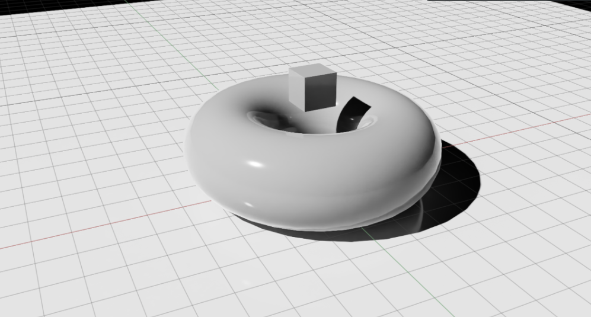
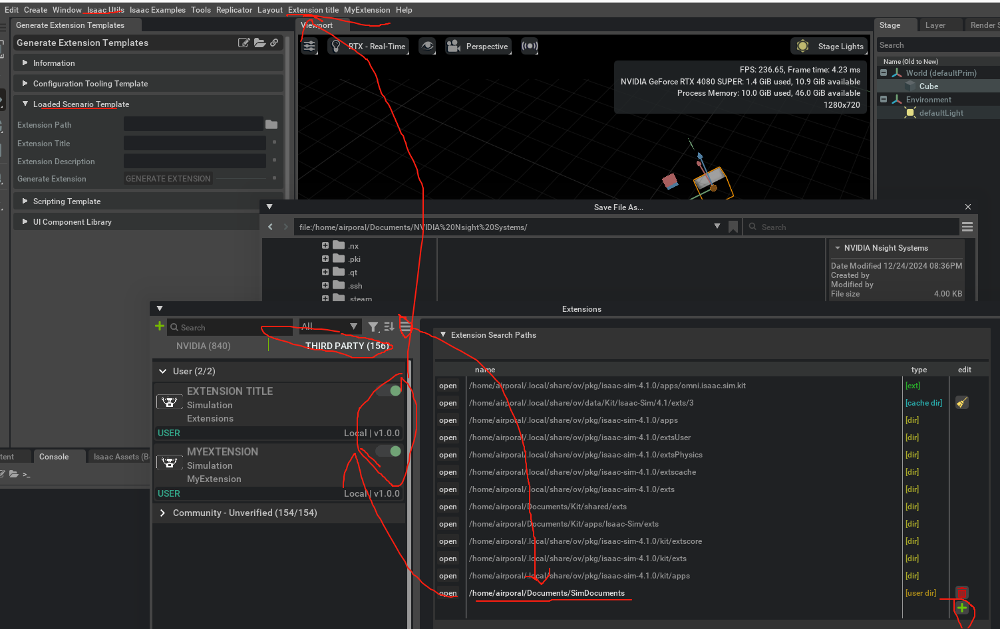
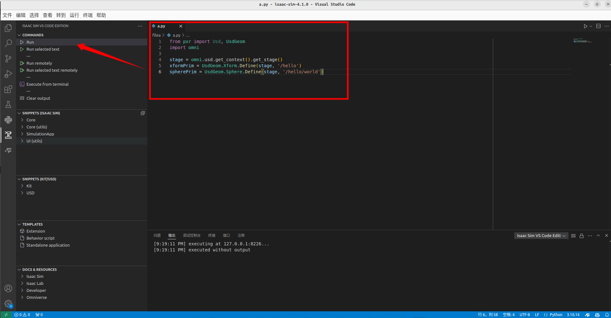
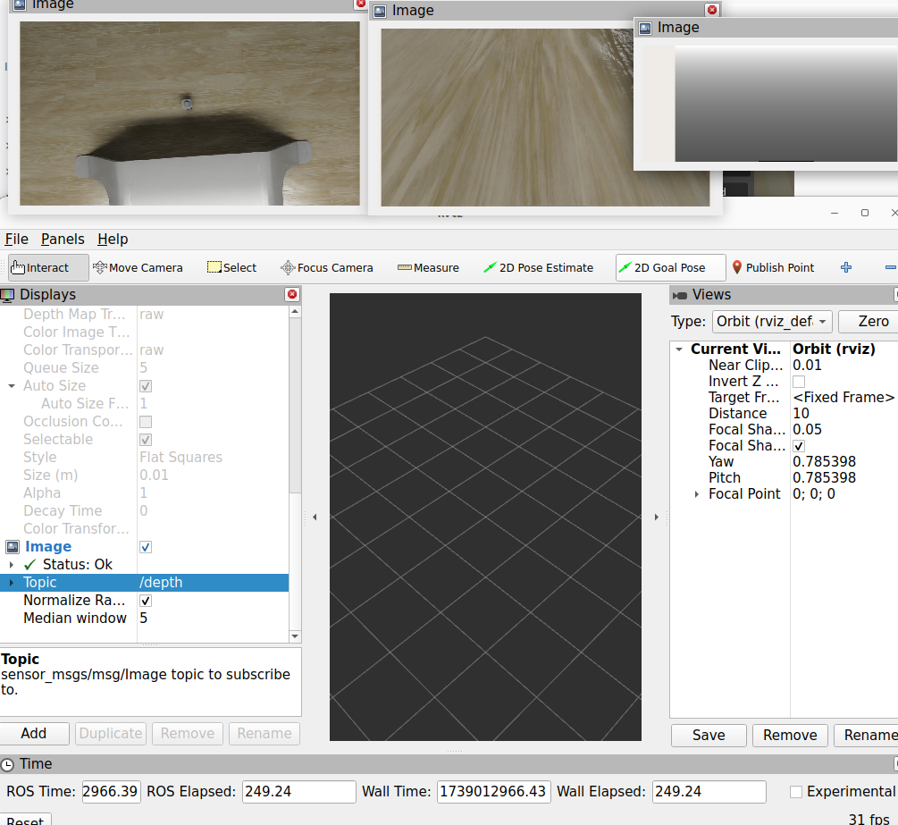
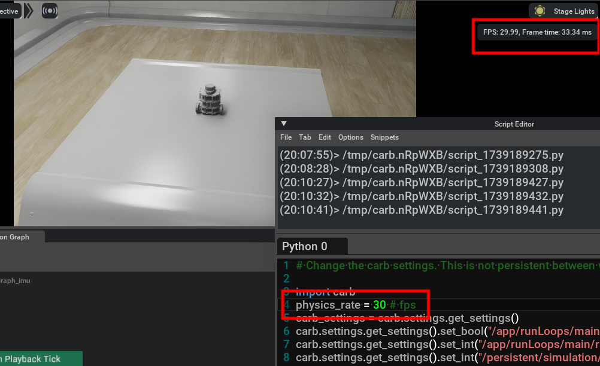

# IsaacSim 学习笔记

> [!IMPORTANT]
>
> Omniverse Launcher被弃用了。


> IsaacSim是NVIDIA提供的可用于深度强化学校的仿真环境，本文记录在[学习官方手册](https://docs.omniverse.nvidia.com/isaacsim/latest/isaac_sim_reference_architecture.html)的过程中的问题与经验。(isaacsim4.1)
>
> [TOC]
>
> 

## 1. 简介


+ **<font color=red>文件格式</font>**

  + USD

    ​	Isaac Sim利用通用场景描述**USD**文件格式，包括对场景的几何特征、物理场景、碰撞设置以及关节连接的表达。其它格式的文件可通过一些拓展（Open USD  ||  URDF  Importer   ||   Onshape Importer  ||  MJCF Importer等）转化为USD格式然后导入到场景中。

    ​	usd提供可直接编辑的文本格式usda和二进制编码格式usd。usd的各个方面都可以通过c++和python访问。

  + Isaac Sim 利用材质定义语言**MDL**对图像中的才质进行着色。

  + 约定的[单位表示](https://docs.omniverse.nvidia.com/isaacsim/latest/reference_conventions.html)：距离：米；时间：秒；质量：千克；角度：度数。

  + 坐标系：世界坐标系：z轴向上，x轴向前，y轴右手确定；USD坐标系：z轴向里，y轴向上，x轴右手确定；Ros坐标系：z轴向前，y轴向下，x轴右手确定。

  + prim 是“primitive”的缩写，是 Omniverse 中的基本单位。在usd场景中导入或创建的任何东西都是 prim。这包括相机、声音、灯光、网格等等。从技术上讲，usd是元数据、属性和其他原语的容器。

  + xform是Omniverse中用来描述位置的基本元素

+ <font color=red>**接口**</font>

​	Isaac Sim 提供内置的**python环境**，所有的Issac sim库和依赖项都可以通过这个环境访问。可使用VScode进行编程。也可在IsaacSim界面中的Window--> Script Editor打开python脚本编辑器。


​	提供**ROS Bridge（**1和2）来连接ROS和Isaac Sim。Isaac内部也提供ROS库的最小实现，

​	可使用python(3.10以上）、C++接口编写拓展。


​	在[Isaac sim安装路径下提供python环境、Jupyter 、Vscode的启动脚本，已经配置好可以方便使用。](https://docs.omniverse.nvidia.com/isaacsim/latest/installation/install_python.html)

+ <font color=red>**功能**</font>

​	提供传感器模拟拓展，拥有GUI操作界面。

​	可随机初始化资产来生成环境场景。

​	使用多个GPU设置多个机器人的运动。

​	Isaac Perceptor 提供用于感知、定位的功能插件

​	Isaac Manipulator 提供对象检测和姿态估计、碰撞等功能，可用于轨迹规划等

​	Isaac Lab 是一个统一的模块化机器人学习框架，基于Omniverse Isaac Sim 建立，可用于强化学习、从演示中学习和运动规划。

​	基于ROS2和Jetson 设备可以实现Sim2Real。

​	关

---


## 2. Usd格式与ISAAC基本使用

> 本学习教程主要基于Omniverse IsaacSim[官方文档](https://docs.omniverse.nvidia.com/isaacsim/latest/open_usd.html)

### 2.1 USD格式

> 在Isaac Assets中提供一些开源机器人，可在[此链接中](https://docs.omniverse.nvidia.com/isaacsim/latest/features/environment_setup/assets/usd_assets_robots.html#isaac-assets-robots)查看有哪些机器人以及参数。

#### 2.1.1 USDA格式创建与导入

​	在IsaacSim pyhton脚本环境中输入以下内容以建立一个基本的USD文件：

```python
from pxr import Usd, UsdGeom
stage = Usd.Stage.CreateNew('/path/to/HelloWorld.usda')
xformPrim = UsdGeom.Xform.Define(stage, '/hello')
spherePrim = UsdGeom.Sphere.Define(stage, '/hello/world')
# 也可在创建的同时定义
generic_spherePrim = stage.DefinePrim('/hello/world_generic', 'Sphere')
stage.GetRootLayer().Save()
```

​	上面的代码在指定的位置建立了一个usda资产:


+ 类型：USD中的元素（prim)具有各自被指定的类型
  + Xform是一种常见的普适类型(表示变换坐标系)，可以表示仿真环境中所有可运动的元素。是大部分元素父类。
  + Sphere是球体元素。指定它位于hello类型内。
+ 组合：在原始元素的基础上嵌套元素，从而定义出一个新的完全定义的元素，具有其自己的属性。如上面的Xform具有嵌套的Sphere元素。,
+ 自省：在创建元素的同时进行定义，如代码中建立的一个名为generic_spherePrim的Sphere。
+ 命名空间：pxr标准命名空间为UsdGeom，表示一组场景中几何元素的类型。

​	打开usda场景文件：

```python
 import omni
 omni.usd.get_context().open_stage(/path/to/HelloWorld.usda)
```


​	使用多个层：每个usd文件可以作为一个层，可以在不同的层放不同类型的元素以方便管理。

```python
from pxr import Sdf

# 获取所有层
root_layer = stage.GetRootLayer()
session_layer = stage.GetSessionLayer()

# Add a SubLayer to the Root Layer
additional_layer = layer = Sdf.Layer.FindOrOpen("my_layer.usd")
root_layer.subLayerPaths.append(additional_layer.identifier)

# Set Edit Layer
# Method 1
with Usd.EditContext(stage, root_layer):
    do_something()

# Method 2
stage.SetEditTarget(additional_layer)


# Make non-persistent changes to the stage (won't be saved regardless if you call stage.Save)

with Usd.EditContext(stage, session_layer):
    do_something()
```


#### 2.1.2 元素的属性

##### :one:**<font color = red>在python中获取usd场景中的元素并查看属性</font>**

```python
from pxr import Usd, Vt
stage = Usd.Stage.Open("/home/airporal/Documents/SimDocuments/HelloWorld2.usda")
xform = stage.GetPrimAtPath('/hello')
sphere = stage.GetPrimAtPath('/hello/world')
print(xform.GetPropertyNames())
print(sphere.GetPropertyNames())
```

​	输出：

```xml
['proxyPrim', 'purpose', 'visibility', 'xformOpOrder']
['doubleSided', 'extent', 'orientation', 'primvars:displayColor' 'primvars:displayOpacity', 'proxyPrim', 'purpose', 'radius', 'visibility', 'xformOpOrder']
```

:spiral_notepad:由于Xform和spheres都继承自XFormable，因此有相同的部分的属性。

##### :two:**<font color = red>更改获取的元素的属性：</font>**

```python
# 获取需要的元素的属性
radiusAttr = sphere.GetAttribute('radius')
# 获取属性的值
print(radiusAttr.Get())
# 修改属性的值
radiusAttr.Set(10)
```

##### :three:**XformOpOrder属性**

<font color = red>	用于跟踪与管理不同元素来自不同层的坐标变换（运动）。记录了一系列的Xform</font>**

```python
from pxr import UsdGeom, Gf
translation = Gf.Vec3d(1,0,0)
sphere_xformable = UsdGeom.Xformable(sphere)
move_sphere_op = sphere_xformable.AddTranslateOp(opSuffix="moveSphereOp")
move_sphere_op.Set(translation)
```

​	上面的代码中，建立了一个新的坐标系，原点在（1,0,0）,之后将需要移动的目标设置为可移动的，建立坐标变换的坐标系的后缀（将记录在Transform属性中），最后指定并执行坐标变换。

​	还可以直接对父元素Xform进行运动，此时Xform的所有子类元素都会同时运动。

```python
translation2 = Gf.Vec3d(1,1,0)
xform_xformable = UsdGeom.Xformable(xform)
move_xform_op2 = xform_xformable.AddTranslateOp(opSuffix="moveXformOp")
move_xform_op2.Set(translation2)
```

> [!NOTE]
>
> **坐标变化（运动）基于一系列的坐标系完成，USD格式的元素在进行坐标变化是需要进行适当转化，坐标变化不会改变元素的类型。**

##### :four:**<font color = red>材质与颜色属性</font>**

​	材质与颜色属性的创建较为负责，需要先创建材质、着色器然后将着色器绑定成材质的属性，最后设置材质的颜色属性值，将其绑定到其他的元素中即可显示颜色。

```python
from pxr import Sdf, UsdShade

# 首先创建材质
material_path = '/hello/material'
# stage是上面代码中导入的整个环境的USD文件
mat_prim = stage.DefinePrim(Sdf.Path(material_path), "Material")
material_prim = UsdShade.Material.Get(stage, mat_prim.GetPath())
# 创建着色器
shader_path = stage.DefinePrim(Sdf.Path("{}/Shader".format(material_path)), "Shader")
shader_prim = UsdShade.Shader.Get(stage, shader_path.GetPath())

with Sdf.ChangeBlock():
    # 材质属性与着色器链接
    shader_out = shader_prim.CreateOutput("out", Sdf.ValueTypeNames.Token)
    material_prim.CreateSurfaceOutput("mdl").ConnectToSource(shader_out)
    material_prim.CreateVolumeOutput("mdl").ConnectToSource(shader_out)
    material_prim.CreateDisplacementOutput("mdl").ConnectToSource(shader_out)
    shader_prim.GetImplementationSourceAttr().Set(UsdShade.Tokens.sourceAsset)
    shader_prim.SetSourceAsset(Sdf.AssetPath("OmniPBR.mdl"), "mdl")
    shader_prim.SetSourceAssetSubIdentifier("OmniPBR", "mdl")

    omni.usd.create_material_input(
        mat_prim,
        "diffuse_color_constant",
        Gf.Vec3f(0,1,0),
        Sdf.ValueTypeNames.Color3f,
    )
    omni.usd.create_material_input(
        mat_prim,
        "emissive_color",
        Gf.Vec3f(0,1,0),
        Sdf.ValueTypeNames.Color3f,
    )
```

​	此时，在hello元素下出现新的子元素material，同时material具有子元素Shader。绑定元素到新建立的材质中，即可显示颜色属性。

```python
#bind the material
material = UsdShade.Material(material_prim)
binding_api = UsdShade.MaterialBindingAPI.Apply(sphere)
binding_api.Bind(material)
```


​	保存更改后的usda文件，并以文本的格式打开，可以看到以下material部分的内容：


​	其中，diffuse_color_constant代表球体表现出来的颜色。可通过修改这个值来改变颜色。

```python
new_shader = UsdShade.Shader.Get(stage,"/hello/material/Shader")
new_shader.GetInput("diffuse_color_constant").Set(Gf.Vec3f(0,0,1))
```

​	借助内置的API可以快速完成USD的设置：

```python
import omni.kit.commands

omni.kit.commands.execute('CreateAndBindMdlMaterialFromLibrary',
    mdl_name='OmniSurface.mdl',
    mtl_name='OmniSurface',
    mtl_created_list=['/Looks/OmniSurface'])

new_material = UsdShade.Material.Get(stage, "/Looks/OmniSurface")

binding_api = UsdShade.MaterialBindingAPI.Apply(sphere)
binding_api.Bind(new_material)
```

​	更多内置预设置指令可在Window-->Commands窗口中查询。


---


### 2.2 Isaac物理

> [!CAUTION]
>
> Isaac通过PhysX 5实现支持GPU的物理模拟，先解析USD文件中的元素资产到PhysX SDK后端以创建物理对象，之后在 每个离散时间步中进行物理模拟，将更新的物理状态更新到USD中给其它拓展进行处理，如视觉渲染等，最后将运行过程中的物理参数变化更新到USD中元素的物理参数与PhysX SDK对象的参数。

资产的物理属性都是使用USD物理模式与Physx模式定义，物理属性由C++定义，也可以使用python API访问。

#### 2.2.1 创建 Physics环境

​	USD阶段的Prim默认不启用物理功能，需要使用UI或在Python脚本添加模拟属性。

​	检查API是否可用以及属性是否存在：

```python
from pxr import Usd, UsdGeom, UsdPhysics, PhysxSchema
import omni.usd

stage = omni.usd.get_context().get_stage()
prim = stage.GetPrimAtPath("/Path/To/Prim")
# 这里的some、another指的是自己要调用的API
physics_api_prim = UsdPhysics.SomePhysicsAPI(prim)
physx_api_prim = PhysxSchema.AnotherPhysxAPI(prim)

# Check if the API is Applied, if not, Apply it.
if not physics_api_prim:
    physics_api_prim = UsdPhysics.SomePhysicsAPI.Apply(prim)

physics_attr = physics_api_prim.GetSomePhysicsAttr()
physx_attr = physx_api_prim.GetPhysxAttr()

# Check if Attribute is authored, otherwise create it
if not physics_attr:
    physics_attr = physics_api_prim.CreateSomePhysicsAttr(1.0)
print(physics_attr.Get())
physics_attr.Set(10.0)

```

​	物理属性名称标准为：

```
schema_name : attribute_name
```

​	将鼠标悬停在属性名位置即可显示，属性模式与属性名。可根据这一信息确定获取该属性的函数接口：

```python
# 如果模式是physics,属性名是velocity,且元素是刚体，则使用下面的API获取特征
UsdPhysics.RigidBodyAPI(prim).GetVelocityAttr()
```

​	物理模拟速度通常大于仿真渲染速度和实际真实速度，前者使得每个渲染帧空隙可能在后台发生多个物理模拟步，后者使得当前状态的仿真速度和实时速度不匹配，出现速度扭曲，Isaac通过默认配置一个限制器来匹配实时速度，缓解这种现象。

​	物理步时间不必与系统时间一致，如果仿真速度快于真实速度，可以在时间轴中运行加速版本模拟而无需渲染或帧阻塞。

+ 设置渲染时间帧：


+ 设置物理时间步长

  ​	物理时间步长需要在物理场景中确定，如果没有物理场景，则默认为60步每秒。按照如下方法添加物理场景:

  + 添加物理场景

  

  + 设置每秒模拟步数	


+ 创建新场景，并添加地平面：

​	点击File可以New一个新环境，默认没有启用物理功能，在create中先添加一个地平面，按下图：


#### 2.2.2 刚体

​	刚体是最基本的元素，添加刚体动力学使得元素可以受重力和其它外力。
​	首先建立一个新的坐标系xform：点击create->xform；将xform拖动至World 下，并调整xform相对World xform的偏移量。**选择Add->Physics->Rigid Body将其添加为刚体。**在新建的xform下创建一个Cube Mesh，调整它相对于新建的xform的坐标偏移。


​	按下UI界面左边的播放键即可开始仿真，Cube会一直下落。

<font color=red>**如果不添加刚体则元素不可运动。**</font>

#### 2.2.3 碰撞器

​	通过Collider API向刚体添加碰撞检测器使得刚体会发生碰撞而不是一直下落。


​	添加一个新的方块，厚度设为0.01（平台），设置碰撞但不设置为刚体，并移动xform到z = 80，之后再进行仿真，方块不会掉落在平台上，因为速度太快，在一个时间步中，方块位于平台上面，下一个时间步方块完全位于平台下面了，碰撞未被捕捉。，如果稍微改变高度，则可能能落到平台上。这这种情况不会发生在地面上，因为地面实现了一个力场，使得被穿透的物体被推向地表面。

+ CCD连续碰撞检测

将物体从一个姿势扫描到下一个姿势，给刚体添加这一属性可以解决上面的问题。

<font color=red>**向一个父元素添加属性，其下面的子元素都将具备该属性。**</font>

#### 2.2.4 凸包

​	添加一个torus，运行时，方块会掉落在torus的上方，因为网格几何体默认是凸包的，使得仿真可以较为高效的获得近似解。



​	查看正在使用的碰撞形状：


​	此时torus上出现绿色碰撞检测的调试线：


​	在window菜单栏依次点击simluation->Debug，进入该栏打开Solid Collision Mesh Visualization，此时点击torus可以查看碰撞网格。


​	设置convex Decomposition凸分解模式以改变默认的凸包，也可尝试设置三角分解等方法。通过调试界面更好地查看凸包划分的形状。


​	三角形网格和简化网格不受支持，可用较为精确的SDF网格替代。

#### 2.2.5 力参数

**Collision->advanced->Rest offset：**调整碰撞几何体尺寸，当物体比较小的时候，可以用来使得碰撞位置与视觉表示一致。

**Collision->advanced->Contact offset：**调整接触偏移，使得碰撞增加碰撞约束，但会带来更多计算消耗。但偏移较小可能使得检测太晚，出现抖动或者错过接触，甚至隧道效应。类似CCD的效果。

**Compliant Contact弹性接触动力学**：向物理材质添加该项使得刚体能够近似变形。


​	**Damping Combine Mode :** 接触摩擦系数选择模式。接触的物体各自具有指定的阻尼组合模式，当多个物体相互接触时，按照组合模式选择优先级最高的模式作为多个物体接触时的阻尼。
$$
								average<min<multiply<max
$$


​	**Physics Static Collision Extension物理静态碰撞拓展API：**可用于向整个Stage中添加静态碰撞，也可用于删除所有与物理相关的API以用于测试。（不支持动态对象）

​	

​	在Window菜单栏中可以打开拓展窗口以开启拓展，在IsaacUtils->Physics Utils中打开拓展。

​	Apply to childre 表示将碰撞应用于选定的对象和其子类，否则只用于选定的对象；

​	Visible Only 忽略隐藏的元素，只向可见元素添加碰撞

​	Collision Type 使用的碰撞类型

​	Remove Collision API 移除所有的碰撞


​	<font color=red>**在应用或者删除碰撞API后再启用可视化，否则拓展可能遍历所有子树，导致性能下降。**</font>

#### 2.2.6 关节与运动

+ 添加关节

关节需要至少两个物体，按住ctrl依次选择要添加关节的物体，之后在Create->Physics->Joints中创建需要的关节。


​	如图添加了在xform和torus中添加了旋转关节，默认围绕x轴旋转，可在RevoluteJoint属性栏中修改。按住shift可以使用鼠标与环境中的物体交互。

​	设置关节时，第一个选择的物体必须在第二个物体的位置的上方，位于关节树中更高层次，才能使得PhysX和USD中具有一一对应的关系。

+ 关节限制

​	关节限制决定关节可以从其原始位置移动多远，默认情况下，创建关节后没有任何限制，选择关节后在属性面板可以调整关节的上限和下限。

+  关节驱动

​	在关节属性界面点击Add->Physics->Angular Drive可为关节添加驱动属性，再在属性面板修改力、位置、速度等控制条件。

​	**位置控制：设置高的stiffness和相对较低或为0的damping。**

​	**速度控制：设置较高的damping和0 stiffness。**

+ Articulation

​	直接添加joint的驱动可以使机器人运动，但是并不高效。添加为Articulation具有更高的模拟保真度、更少的连接错误、并且可以在关节之间进行更大的集成。


​	设置一个Articulation root 来一系列连接了的关节和刚体转化为Articulation。Articulation root必须设置为所有Joints的父亲所在的xform。对于固定和漂浮物体需要额外设置。

	

​	选择刚刚设置的Articulation ROOT 以生成Graphs 以及Velocity_Controller。右键单击Velocity_Controller可以找到打开graph的选项，选择到对应JointCommandArray的图即可修改输入参数，实现对关节的控制。


+ 

#### 2.2.8 可视化

:one: 残差模拟

​	残差Rasiduals可以用来检测模型对约束的满足程度，残差越小表示模型越好。可以给具有约束的关节添加残存报告，并在可视化的界面中实时显示。

+ 选择关节，点击Add->Physics->Residual Reporting 


+ 依次点击上图设置，显示可视化数据节目，同时，在仿真过程中框选任意元素即可显示框选区域中的数据变化。


### 2.3 Isaac 技巧汇总

> [!IMPORTANT]
>
> 列出Isaac文档和使用过程中总结出来的Isaac使用与优化技巧。受[PhysX引擎限制与解决方](https://docs.omniverse.nvidia.com/isaacsim/latest/simulation_fundamentals.html)法见此。

+ 资源加载卡死

​	使用clash的全局tun模式，再在终端运行下面代码以打开omniverse-launcher：

```bash
./omniverse-launcher-linux.AppImage --proxy-server=127.0.0.1:7890

```

​	或直接打开也许可以。

使用omni.activity.ui拓展在加载资源时监视进度和活动。

+ 物理步长

​	物理步长决定了每个物理模拟步骤的时间间隔，步长越小模拟越精确，消耗的计算资源就越高，从而减缓模拟速度。较大的物理步长能加快模拟速度但导致物理精度降低。使用world.set_physics_step(step_size)函数设置物理步长。

+ 最小模拟帧率

​	最小模拟帧率决定了每秒物理仿真的最小数量，如果实际帧率小于此值，模拟会减慢速度以保持物理的准确性（掉帧）。使用world.set_min_simulation_frame_rate(frame_rate)函数设置帧率。

+ GPU Dynamics

​	使能GPU Dynamics可以将计算加载到GPU上进行，当GPU性能足够时可以较大提升模拟速度。使用 world.set_gpu_dynamics_enabled(enabled)函数来使能GPU。

​	当仿真的环境计算量较小时，GPU带来的IO操作可能使得仿真更加缓慢。

​	如果的机器有多个 GPU，可设置模拟和渲染以使用两个不同的 GPU。

+ 优化场景

​	通过减少场景细节降低仿真环境中的场景细节以及优化物理设置可以减少计算量。

​	**碰撞几何体选择**：碰撞几何体越简单，模拟速度越快。例如，SDF 网格碰撞器比简单的球体更昂贵。

​	**可变形或粒子特征**：可变形和粒子的模拟成本比刚体高得多。您可能想尝试刚体和柔性接触，或用关节连接的刚体来近似可变形几何体，而不是可变形。

+ 手动设置线程数量

  通过修改omni.physx GPU设置线程数量以提高速度。

​	也可以调整用于模拟的 CPU 线程数。线程数减少可能可以加快速度的。这可以在“首选项”选项卡的“物理”部分中进行更改。0 可单线程运行模拟，通常会为小场景提供最佳性能。

+ 禁用材质和灯光

​	禁用所有材料，将其设置为-1以恢复：

```python
import carb
carb.settings.get_settings().set_int("/rtx/debugMaterialType", 0)
```

+ **OV 解算器设置**：

​	将解算器迭代次数降低到仍能获得可接受的模拟保真度的计数将对性能有很大帮助。可以在场景中设置全局迭代限制。

+ 运行时结构中的渲染变换

​	将渲染变化和其他模拟状态写回USD的成本很高，此时使用物理拓展来代替。

+ **异步模拟和渲染**

​	在场景设置中，可以尝试使用异步更新设置来并行运行模拟和渲染。这对于不需要每一步都运行自定义 Python 代码的模拟来说是理想的选择，因为从单独的线程调用 Python 时可能会出现问题。

+ **意外碰撞几何重叠**：

​	在设置具有许多并行环境的强化学习模拟场景时，请确保不要复制碰撞几何（例如地面平面），因为这会产生大量环境间重叠，而这些重叠在碰撞阶段的检查成本很高。下面是一个错误设置的场景示例，其中环境中的地面平面已被复制多次。由于地面平面是无限的，每个地面平面都会接触所有环境，从而导致性能和内存使用问题。

+ **禁用场景查询支持**
如果不使用场景查询，您可以禁用对它的支持以提高性能。这可以在 PhysicsScene 的属性面板中更改。


```bash
2025-02-15 09:45:46 [4,712ms] [Warning] [rtx.scenedb.plugin] SceneDbContext : TLAS limit buffer size 7374781440
2025-02-15 09:45:46 [4,712ms] [Warning] [rtx.scenedb.plugin] SceneDbContext : TLAS limit : valid false, within: false
2025-02-15 09:45:46 [4,712ms] [Warning] [rtx.scenedb.plugin] SceneDbContext : TLAS limit : decrement: 167690, decrement size: 7301033856
2025-02-15 09:45:46 [4,712ms] [Warning] [rtx.scenedb.plugin] SceneDbContext : New limit 9748724 (slope: 439, intercept: 13179904)
2025-02-15 09:45:46 [4,712ms] [Warning] [rtx.scenedb.plugin] SceneDbContext : TLAS limit buffer size 4287352704
2025-02-15 09:45:46 [4,712ms] [Warning] [rtx.scenedb.plugin] SceneDbContext : TLAS limit : valid true, within: true
2025-02-15 09:45:47 [5,923ms] [Warning] [omni.usd-abi.plugin] No setting was found for '/rtx-defaults-transient/meshlights/forceDisable'
2025-02-15 09:45:47 [5,953ms] [Warning] [omni.usd-abi.plugin] No setting was found for '/rtx-defaults/post/dlss/execMode'

```

+ 关节刚度与阻尼

高刚度：关节更硬，对偏移反映更强，跟踪精度更高，但抗干扰能力差，容易振荡或不稳定，适合工业机械臂场景。低刚度适合协作机器人。

高阻尼：运动更平稳，减少振动，但响应速度慢，能量损耗增加。

速度控制时，可以设置为：阻尼10000000.0，刚度0

位置控制时，可以设置为：

---

## 3. UI和Workflow

### 3.1 快捷键与修改ui默认配置参数

E：切换到旋转状态，多次按E可以在局部旋转和全局旋转之间切换。

W：切换到平移状态，多次按W可以在局部平移和全局平移之间切换。

ESC：退出选中状态。

F：将相机居中并缩放到所选的对象上。未选中任何物体时可以缩放到全部对象。

Alt+鼠标左键：视线围绕选中的对象旋转。

Alt+鼠标右键(或鼠标滚轮)：放大或缩小视线。

鼠标中键：平移

stage是一个基于树的部件，用于组织和构建Isaac Sim场景中的所有内容。

+ 通过拖拽部件可以创建父子关系，子prim的位置相对于父prim确定。移动父prim，子prim也会相对运动。

+ 删除父级prim，其下的子prim都会被删除。

打开时间线Window->extensions->**omni.anim.window.timeline**。

+ 要修改ui界面的默认的参数，除了可以直接在ui界面修改外，还可以使用以下方法：

:one:使用carb库来获取并设置参数

```python
import carb.settings
import omni.kit

## Set Carb Setting
settings = carb.settings.get_settings()
settings.set("/exts/isaacsim.my.extension/data/foo", True)

## Restart Extension to Apply Changes
omni.kit.app.get_app().get_extension_manager().set_extension_enabled_immediate("isaacsim.my.extension",False)
omni.kit.app.get_app().get_extension_manager().set_extension_enabled_immediate("isaacsim.my.extension",True)
```

:two:使用命令行打开界面时运行脚本参数：

```bash
./isaac-sim.sh --/exts/isaacsim.my.extension/data/foo=True
```

:three:修改插件的toml文件

:four:修改apps目录下对应的kit​

### 3.2 Gui 界面

​	GUI界面是用于填充和模拟虚拟世界的画面的工具，主要用于构建世界、组装机器人、连接传感器以及初始化ROS。基于Omniverse USD Composer。

​	在运行Omniverse Isaac 时只能有一个World可以存在。

​	**从python.sh直接启动并加载独立的应用**：

```python
./python.sh standalone_examples/api/omni.isaac.franka/follow_target_with_rmpflow.py
```

+ 创建新项目

​	点击File-> New将新建一个包含World xform 和Environment xform的新stage。

+ 设置物理场景

​	一般只有当模拟数百个刚体和机器人的时候才使用GPU获得更佳的效率，否则CPU的效率更高。

​	点击Create->Physics->Physics scene创建出一个新的物理场景，在PhysicsScene属性栏可以查看到重力的方向和大小，设置Disable GPU Dynamics并在Broadphase Type选项选择MBP可以设置使用CPU进行解算，默认情况下使用GPU。

+ 添加光源


​	点击Create->Light并选择需要的光源，在光源属性栏中可以设置参数。

+ 添加物理材质和颜色。

​	物理材质在Create->Physics->PhysicsMaterial下添加，在stage中会建立一个prim，设置相应的摩擦等性质后，在需要该物理材质的prim下选择该材质。

​	颜色在Create->Material->OmniPBR下新建，设置颜色相应的属性后再给到需要的Prim。

​	**给图形设置刚体和碰撞。**

+ 在UI界面的Content 选项中可以处理本地和云端的资产，包括对资产的收集与保存、打开。

​	如果一个文件中使用了来自其它文件中的多种USD、Materials、textures,需要在Content中将用到的内容Collect 到同一个文件夹中。


+ 导入Reference到当前world的stage下：会导入一个以文件名命名的prim，包含了导入文件的所有层次内容。设置导入的reference的某一部分时，需要在stage上将需要的部分设置为独立的parent,然后设置为defaultPrim，之后保存。导入时仅仅会导入defaultPrim下的项目。


### 3.3 Extensions

​	拓展用于实时的物理仿真，主要用于构建交互式GUI、自定义应用程序模块和实时应用程序。基于Imniverser Kit。

+ 编写自定义python拓展：

​	在Isaac Utils中点击Generate Extension Templates，选择模板类型和信息，填写路径与模板名等，最后点击生成

​	在Window -> Extensions中，添加拓展路径，需要填写拓展所在的文件夹的父文件夹，否则可能无法加载。加载后启动拓展即可在UI界面工具栏中显示。



+ 编写[自定义C++拓展可参考模](https://docs.omniverse.nvidia.com/kit/docs/kit-extension-template-cpp/latest/index.html)板。

### 3.4 传感器

IsaacSim支持相机、雷达、激光雷达等RTX传感器还支持关节传感器、接触式传感器、力传感器、IMU传感器、近距离传感器等物理传感器和基于PhysX的激光传感器、激光雷达等。

​	添加传感器总的来说可以分为以下步骤进行：

+ 选择需要的传感器，如相机，将对应的prim放在需要安装传感器的对象的prim下面，使得传感器与该对象同步运动
+ 设置传感器的位置、角度等参数，使得传感器数据较为合适
+ 接收传感器数据


**3.4.1 接触力传感器**

添加接触力传感器：选择一个prim然后在create->sensor->contact sensor即可为该prim添加接触力传感器。

读取接触力传感器：


也可使用python完成上述操作，参考https://docs.isaacsim.omniverse.nvidia.com/4.5.0/sensors/isaacsim_sensors_physics_contact.html。

###  3.5 python交互

> ​	REPL （Read-Evaluate-Print loop）即读取-评估-打印循环，允许读取并评估代码片段，并以交互式的方式查询本地变量的状态。Jupyter Notebook是REPL的一个应用。

+ 使用Ipython进行交互

​	需要先打开IsaacSim，并开启Isaac Sim REPL拓展，之后在新的终端中输入：

```bash
telnet localhost 8223
```

​	即可打开命令行模式，此状态下与直接在IsaacSim的脚本编辑器中的作用完全相同。


​	**按下ctrl+D即可退出终端。**

可输入以下命令测试：

```python
from pxr import UsdPhysics, PhysxSchema, Gf, PhysicsSchemaTools, UsdGeom
import omni

stage = omni.usd.get_context().get_stage()

# Setting up Physics Scene
gravity = 9.8
scene = UsdPhysics.Scene.Define(stage, "/World/physics")
scene.CreateGravityDirectionAttr().Set(Gf.Vec3f(0.0, 0.0, -1.0))
scene.CreateGravityMagnitudeAttr().Set(gravity)
PhysxSchema.PhysxSceneAPI.Apply(stage.GetPrimAtPath("/World/physics"))
physxSceneAPI = PhysxSchema.PhysxSceneAPI.Get(stage, "/World/physics")
physxSceneAPI.CreateEnableCCDAttr(True)
physxSceneAPI.CreateEnableStabilizationAttr(True)
physxSceneAPI.CreateEnableGPUDynamicsAttr(False)
physxSceneAPI.CreateBroadphaseTypeAttr("MBP")
physxSceneAPI.CreateSolverTypeAttr("TGS")

# Setting up Ground Plane
PhysicsSchemaTools.addGroundPlane(stage, "/World/groundPlane", "Z", 15, Gf.Vec3f(0,0,0), Gf.Vec3f(0.7))

# Adding a Cube
path = "/World/Cube"
cubeGeom = UsdGeom.Cube.Define(stage, path)
cubePrim = stage.GetPrimAtPath(path)
size = 0.5
offset = Gf.Vec3f(0.5,0.2,1.0)
cubeGeom.CreateSizeAttr(size)
cubeGeom.AddTranslateOp().Set(offset)

# Attach Rigid Body and Collision Preset
rigid_api = UsdPhysics.RigidBodyAPI.Apply(cubePrim)
rigid_api.CreateRigidBodyEnabledAttr(True)
UsdPhysics.CollisionAPI.Apply(cubePrim)
```

+ 编写python文件独立运行

编写完成后，通过python.sh脚本运行py文件：

```python
./python.sh /home/airporal/.local/share/ov/pkg/isaac-sim-4.1.0/exts/omni.isaac.examples/omni/isaac/examples/user_examples/my_application.py
```

也可在vscode中实时渲染。

### 3.6 vscode && jupyter

+ **使用  vscode运行代码**

首先需要在isaac中打开omni.isaac.vscode扩展，在vscode 中安装Isaac SIm Vs Code Edition拓展。然后在此处快捷打开vscode：


打开vscode后，在vscode中任意文件夹下编辑新的python文件，在isaac拓展中点击运行即可运行并实时渲染到issac应用界面。



<font color=red>使用vscode调试代码：</font>

**方法1：独立的方式运行python脚本**

在启动界面选择在终端打开，并在终端输入code ./以在当前路径下打开vscode。


打开后使用isaac库编写代码，在调试界面选择Current File，点击运行开始调试。


修改.vscode/launch.json文件的args参赛以传递命令行参数传递给脚本(类似命令行中的--help等参数):


在脚本中调用参数：

```python
server_check = carb.settings.get_settings().get("/presistent/isaac/asset_root/default")
print(server_check)
```

**方法2：调试器附加到正在运行的isaac程序中**

首先打开debug插件：


此时显示未绑定调试器，在打开vscode，选择并运行调试


此时不再调试当前的python文件，而是以isaac的内容进行调试。debug插件显示已经附加：


可通过修改调试设备的ip和端口更改附加的vscode调试主机。

<font color=red>**使用vscode建立自己的stage**:</font>

在exts/omni.isaac.examples/omni/isaac/examples下有许多案例，这些案例对应着isaacSim中的IsaacExample工具栏下的选项，可以基于这些文件快速编写自己的工程。

:one:打开案例路径与vscode

点击Load即可加载路径场景，点击上方两个图标可以分别在vscode和文件夹中打开项目。


在vscode中打开，如果没有代码补全提示则需要在vscode的配置文件中添加包搜索路径。

修改代码后按下ctrl+s保存代码，同时会热载到Isaac中，但是需要重新load才可显示：

如果需要更新场景：


在弹出的窗口选择不保存。

如果不需要更新场景，则直接重新打开案例，点击Load即可。

:two:案例修改

打开案例路径，包含以下三个文件，修改代码主要在hello_world.py中，hello_world_extension.py 主要提供一些可以在IsaacSim应用上的IsaacExample工具栏显示项目的代码，__init__.py负责初始化。


:three:加载新案例到IsaacSim

需要修改三个文件的导入即可。以下时一个对hello_world.py的修改：

```python
# Copyright (c) 2020-2023, NVIDIA CORPORATION. All rights reserved.
#
# NVIDIA CORPORATION and its licensors retain all intellectual property
# and proprietary rights in and to this software, related documentation
# and any modifications thereto. Any use, reproduction, disclosure or
# distribution of this software and related documentation without an express
# license agreement from NVIDIA CORPORATION is strictly prohibited.
#

from omni.isaac.examples.base_sample import BaseSample
import torch
import numpy as np
from omni.isaac.core.objects import DynamicCuboid
# from omni.isaac.core.objects import 
# Note: checkout the required tutorials at https://docs.omniverse.nvidia.com/app_isaacsim/app_isaacsim/overview.html


class HelloWorld(BaseSample):
    def __init__(self) -> None:
        super().__init__()
        print("Hello World Extension")
        print (torch.cuda.is_available())
        return

    def setup_scene(self):
        world = self.get_world()
        world.scene.add_default_ground_plane()
        fancy_cube = world.scene.add(
            DynamicCuboid(
                prim_path="/World/random_cube",
                name="fancy_cube",
                position=np.array([0, 0, 1.0]),
                scale=np.array([0.5015, 0.5015, 0.5015]),
                color=np.array([0, 0, 1.0]),
            ))
        return

    async def setup_post_load(self):
        self._world = self.get_world()
        self._cube = self._world.scene.get_object("fancy_cube")
        # 设置回调函数，每隔一段时间打印物体的位置、朝向和线速度
        self._world.add_physics_callback("sim_step",callback_fn=self.print_cube_info)
        
        
        # position, orientation = self._cube.get_world_pose()
        # linear_velocity = self._cube.get_linear_velocity()
        # # will be shown on terminal
        # print("Cube position is : " + str(position))
        # print("Cube's orientation is : " + str(orientation))
        # print("Cube's linear velocity is : " + str(linear_velocity))
        return
    def print_cube_info(self, step_size):
        position,orientation = self._cube.get_world_pose()
        linear_velocity = self._cube.get_linear_velocity()
        print("Cube position is : " + str(position))
        print("Cube's orientation is : " + str(orientation))
        print("Cube's linear velocity is : " + str(linear_velocity))
        

    async def setup_pre_reset(self):
        return

    async def setup_post_reset(self):
        return

    def world_cleanup(self):
        return

```


+ 使用JupyterLab运行

首先打开omni.isaac.jupyter_notebook插件（第一次打开会下载一些依赖，导致进度缓慢）。点击以下拓展以在浏览器中打开isaac sim的JupyterLab:


在JupyterLab中选择Omniverse(Python3)以建立一个新的文件，之后运行下面代码以在Isaac中实时渲染：


```python
from pxr import Usd, UsdGeom
import omni

stage = omni.usd.get_context().get_stage()
xformPrim = UsdGeom.Xform.Define(stage, '/hello')
spherePrim = UsdGeom.Sphere.Define(stage, '/hello/world')
```

jupyter 默认保存在以下路径：

```bash
/home/airporal/.local/share/ov/pkg/isaac-sim-4.1.0/exts/omni.isaac.jupyter_notebook/data/notebooks
```

**注意：官方文档提示说无法使用matplotlib在jupyter中绘图。**

+ **使用Jupyter Notebook打开：**

在isaacSim文件路径下，运行JupyterNotebook脚本即可自动初始化：

```bash
~/.local/share/ov/pkg/isaac-sim-4.1.0$ ./jupyter_notebook.sh standalone_examples/notebooks/scene_generation.ipynb 
```

运行完成后，手动打开isaacSim,在Jupytert Notebook中编辑内容，需要指定保存一个usd文件，这样可以在isaac中打开该usd文件，从而交互。

```python
import getpass

user = getpass.getuser()
from isaacsim import SimulationApp

# Set the path below to your desired nucleus server
simulation_app = SimulationApp(
    {"headless": True, "livesync_usd": f"omniverse://localhost/Users/{user}/temp_jupyter_stage.usd"}
)
print("Hi")

```

在isaac的content栏中找到该usd文件，并打开即可。设置NUCLEUS LIVE激活实时同步。


环境交互的每个单元格开始都需要手动重置：

```python
world.clear()
# 或
world.reset()
```

在isaac中交互式添加资产后在jupyter中使用时需要手动更新：

```python
simulation_world.step()
# 或
world.render()

```


### 3.7 OmniGraph

​	OmniGraph以一种类似Matlab Simulink 的模式提供每个物理步骤的动作图解。

+ 添加Action Graph

  Action Graph 中的节点需要勾选节点触发以执行动作

  + 依次选择Create-> Visual Scripting-> Action Graph 创建出一个新的Action Graph

  + 在属性页面修改pipelineStage为pipelineStageOnDemand

  + 在Action Graph页面中选择需要的动作，拖拽到Action Graph图中。

+ 添加Push Graph

  Push Graph中的节点会在建立后自动执行而不需要触发。

+ 添加预先设定的图

  Isaac Utils->Common Omnigraphs。包括差速控制的图、夹具控制、位置速度和速度控制。差速控制图结构中可以设置键盘控制节点。导入预设图后，需要修改部分参数，带*的参数必须设置。

  + **关节位置控制器、关节速度控制器：**

  都直接向Articulation中的每个关节发出命令。

  

  Robot Prim：robot的父Prim

  Graph Path：生成的Graph的路径

  Add to Existing Graph：将节点添加到已经存在的图中

  + **差速控制器**

  Robot Prim：机器人的父Prim

  Graph Path：生成的Graph的路径

  Wheel Radius：车轮半径

  distance between wheels：车轮之间的距离（米为单位）

  Right/Left Joint Names：左右轮关节的名称

  Right/Left Joint Index：左右论关节的索引

  Use Keyboard Control：使用键盘控制。如果选择会生成向前、向后、向左、向右运动的键盘控制节点的图。

  Add to Existing Graph：添加到现有图表。

  + 夹具控制器

  

  Parent Robot：包含夹具的机器人，可以是机械臂的原点。

  Graph Path：生成Graph的路径

  Gripper Root Prim：包含所有夹具joint的一个prim

  Gripper Joint Names：控制夹具手指的关节名称，需要全部列出并用逗号分割

  Open/Close Position Limit：关节限制。默认为USD文件中设置的关节限制。

  Use Keyboard Control：自动设置键盘控制的图

  Add to Existing Graph：添加到现有图中。

+ 一些常用图

  + Differential Controller

  

  ​        微分控制器，通过设置轮子的间距与半径，结合其它参数可以完成对小车的差速控制。

  + Articulation Controller

    

    通过设置关节和Articulation可实现对关节的驱动。通常作为最低层控制器来结合一些其它的控制器完成运动控制。需要指定保护Articulation root的prim以及关节名，可使用constant token作为设置。

  + Make Array
    
    将多个输入组合成数组输出，需要指定输入的类型和个数。		

  + Constant token

  

  ​	设置可以输出一个常量的节点，通过Make Array可以将常量组合为数组。

  + On Playback Tick

    

    ​	可以作为action graph的tick，使得每一帧自动产生一次触发信号，触发信号可以作用于其它节点以使得每个帧其它节点受到触发。直接将tick连接到需要节点的exec in 即可。

  + Read Gamepad state

    

    通过绑定手柄的按钮，能够接收手柄的信号来作为数据输入。一般后面需要接上todouble节点

  + Read Keyboard State

    

    通过绑定键盘的值，作为输入信号进行输入。一般后面需要接上todouble节点。

    + 使用python脚本编辑OmniGraph

    ```pyhon
    import omni.graph.core as og
    
    keys = og.Controller.Keys
    (graph_handle, list_of_nodes, _, _) = og.Controller.edit(
        {"graph_path": "/action_graph", "evaluator_name": "execution"},
        {
            keys.CREATE_NODES: [
                ("tick", "omni.graph.action.OnTick"),
                ("print","omni.graph.ui_nodes.PrintText")
            ],
            keys.SET_VALUES: [
                ("print.inputs:text", "Hello World"),
                ("print.inputs:logLevel","Warning")                 # setting the log level to warning so we can see the printout in terminal
            ],
            keys.CONNECT: [
                ("tick.outputs:tick", "print.inputs:execIn")
            ],
        },
    )
    ```

    + 自定义Omnigraph python节点

    自定义节点需要编写py和ogn两类文件，放在isaac/exts/的对应目录下，如：

    ```bash
    /home/airporal/.local/share/ov/pkg/isaac-sim-4.1.0/exts/omni.isaac.core_nodes/omni/isaac/core_nodes/ogn/python/nodes
    ```

    也可直接修改已经存在的节点的该文件，从而快速建立新的节点。

    关于使用python、c++建立新的拓展、图节点可查看官方手册。
    
    + 使用python脚本向stage中添加新的节点：
    
    ```python
    import omni.graph.core as og
    og.Controller.edit(
        {"graph_path": "/ActionGraph","evaluator_name": "exection"},
        {
          og.Controller.Keys.CREATE_NODES: [],
          og.Controller.Keys.CONNECT: [],
          og.Controller.Keys.SET_VALUES: [],  
        },
    )
    ```
    
    例如：
    
    ```python
    import omni.graph.core as og
    
    og.Controller.edit(
        {"graph_path": "/ActionGraph", "evaluator_name": "execution"},
        {
            og.Controller.Keys.CREATE_NODES: [
                ("OnPlaybackTick", "omni.graph.action.OnPlaybackTick"),
                ("PublishJointState", "isaacsim.ros2.bridge.ROS2PublishJointState"),
                ("SubscribeJointState", "isaacsim.ros2.bridge.ROS2SubscribeJointState"),
                ("ArticulationController", "isaacsim.core.nodes.IsaacArticulationController"),
                ("ReadSimTime", "isaacsim.core.nodes.IsaacReadSimulationTime"),
            ],
            og.Controller.Keys.CONNECT: [
                ("OnPlaybackTick.outputs:tick", "PublishJointState.inputs:execIn"),
                ("OnPlaybackTick.outputs:tick", "SubscribeJointState.inputs:execIn"),
                ("OnPlaybackTick.outputs:tick", "ArticulationController.inputs:execIn"),
    
                ("ReadSimTime.outputs:simulationTime", "PublishJointState.inputs:timeStamp"),
    
                ("SubscribeJointState.outputs:jointNames", "ArticulationController.inputs:jointNames"),
                ("SubscribeJointState.outputs:positionCommand", "ArticulationController.inputs:positionCommand"),
                ("SubscribeJointState.outputs:velocityCommand", "ArticulationController.inputs:velocityCommand"),
                ("SubscribeJointState.outputs:effortCommand", "ArticulationController.inputs:effortCommand"),
            ],
            og.Controller.Keys.SET_VALUES: [
                ("ArticulationController.inputs:usePath", True),
                ("ArticulationController.inputs:robotPath", "/World/franka_alt_fingers"),
                ("PublishJointState.inputs:targetPrim", "/World/franka_alt_fingers")
            ],
        },
    )
    
    
    ```
    
    

### 3.8 拓展模块


由拓展模板生成器提供建立的拓展模块都具有共同的底层结构和不同的顶层结构。拓展模块的根目录中有一个scripts文件夹，该文件夹中包含了拓展模块构成的所有python文件：


**global_variables.py:**   专门存放所有全局变量的脚本

**extension.py:**   包含使得拓展显示在IsaacSim界面上的一些标准类的实现，在extension.py中创建了有用的标准回调函数，需要在ui_builder.py中完成这些函数。

**ui_builder.py:**  用户需要实现的拓展的主要实现逻辑，用户需要完成此脚本中的回调函数，还包括拓展的UI。

+ on_menu_callback()：打开拓展时调用
+ on_timeline_event()：时间线停止、暂停、播放时调用
+ on_physics_step()：每个物理步上调用
+ on_stage_event()：stage打开或者关闭时调用
+ cleanup()：用于拓展正在关闭时清除相关资源时调用
+ **build_ui()：**创建需要的ui。大部分实现都在此函数中，拓展模板用omni.ui元素的包装类，允许用户创建和管理各种UI元素。

:latin_cross:**加载场景模块Loaded Scenario Template**：

加载场景模块的目的是让用户更容易与模拟器交互而不需要进行关节等资产的初始化。

omni.isaac.core.world 中实现了一个类world，提供加载和重置世界的按钮用来管理模拟，用户与世界的交互通过使用world.scene.add(object)添加对象完成。

Load的实现有两个回调函数:

+ setup_scene_fn()：在按下Load按钮后，调用此函数创建一个新的World，用户可以将资源加载到此world上通过world.scene.add()。
+ setup_post_load_fn()：完成场景的初始化，将时间线在0处暂停。

Reset的实现有两个回调函数：

+ pre_reset_fn()：在重置前调研，保证模拟器的状态。
+ post_reset_fn()：将世界的时间线恢复到0的位置，并且将所有的对象移动到初始的位置。

Run未连接到World，它是一个StateButton，状态在Run和STOP之间切换，具有三个回调函数：

+ on_a_click()：在一个状态时调用此回调函数显示一种文本
+ on_b_click()：在另一个状态时调用此回调函数显示另外的文本
+ Physics_callback_fn()：处于B状态时，会在每个物理步上调用此函数，当状态切换到A状态时取消所有物理订阅。


**脚本模板Scripting Template**

和加载场景模板类似

​	在拓展的scene.py中作为类的成员函数实现goto_position()、open_gripper_franka()和close_gripper_franka()。这些函数使用yield语句，以在每次调用的时候使用next来步进。

**配置工具模板Configure Tooling Template**

用于做一些控制器

​	配置工具模板提供构建资产配置工具的模板，提供实现创建一个下拉菜单，用于查找仿真中任意Articulation并动态创建一个UI框架，用户可以通过该框架控制所选Articulation中的每个关节。

**UI组建库 UI Component Library**

用于自定义UI界面

​	UI 组件库模板演示了已创建的每个 UIElementWrapper 的用法。设置自定义 UI 工具时应将其用作参考。最重要的是，此模板显示了可附加到每个 UIElementWrapper 的每个回调函数所需的特定参数类型和返回值。此模板省略了“加载”和“重置”按钮，因为这些是加载场景模板中演示的特殊情况按钮。此模板中显示的 UI 组件均不会直接影响模拟；他们只调用用户回调函数。

## 4. 核心API

> 使用python编写工作流的基本方法

### 4.1 Hello Robot

​	借助IsaacSim提供的Jetbot机器人资产,使用python脚步编写仿真方法.借助前面介绍的IsaacExample中新建的自己的模板来完成编写.首先打开Awsome Example或则任意自己建立的新的模板案例.点击编辑代码.

​	如前面介绍的,编写主要在hello_world.py脚本中完成.首先导入一些用到的包:

```python
# 使用案例模板必须继承的类
from omni.isaac.examples.base_sample import BaseSample
# 获取操作关节的包
from omni.isaac.core.utils.types import ArticulationAction
# nucleus包,用来获取云上资源
from omni.isaac.core.utils.nucleus import get_assets_root_path
# 和操作stage树的库,通常需要将新建的prim加入到stage中
from omni.isaac.core.utils.stage import add_reference_to_stage
# robots库可以在世界场景中新建robot
from omni.isaac.core.robots import Robot
# wheeled_robots库可以在世界场景中新建轮子机器人,此时不需要再设置添加到stage,更加集成的操作.
from omni.isaac.wheeled_robots.robots import WheeledRobot

import carb
import numpy as np
import time
```

主要使用omni.isaac.core下的一系列api完成.针对特殊的对象可能存在对于的库.

修改setup_scene函数,以初始化世界

```python
    def setup_scene(self):
        # 获取当前世界
        world = self.get_world()
        # 添加默认地面
        world.scene.add_default_ground_plane()
        # 获取assets路径
        assets_root_path = get_assets_root_path()
        # 如果assets路径为空，则打印错误信息
        if assets_root_path is None:
            carb.log_error("Could not find nucleus server with /Isaac folder")
        # 获取jetbot的路径
        asset_path = assets_root_path + "/Isaac/Robots/Jetbot/jetbot.usd"
        # 添加jetbot到stage中
        add_reference_to_stage(usd_path=asset_path,prim_path="/World/MyJetbot")
        # 将jetbot的实例化对象添加到世界中
        jetbot_robot = world.scene.add(
            Robot(prim_path="/World/MyJetbot",name="MyJetbot")
            )
        print(f"Num of degrees of freedom before first reset:{str(jetbot_robot.num_dof)}")
        # 使用
        self._jetbot2 = world.scene.add(
           WheeledRobot(prim_path="/World/MyJetbot2",name="MyJetbot2",wheel_dof_names=["left_wheel_joint", "right_wheel_joint"],create_robot=True,position=[2,2,0],usd_path=asset_path)
        )
        return
```

修改异步函数setup_post_load(self)以在点击开始按钮时异步调用该函数,这里用了一个物理帧回调函数以在每个物理帧执行一次关节驱动:

```python
    async def setup_post_load(self):
        self._world = self.get_world()
        self._jetbot = self._world.scene.get_object("MyJetbot")
        self._jetbot2 = self._world.scene.get_object("MyJetbot2")
        self._jetbot_articulation_controller = self._jetbot.get_articulation_controller()
        self.begin = time.time()
        
        self._world.add_physics_callback("sending_actions",callback_fn=self.send_robot_actions)
        print(f"Num of degrees of freedom after first reset:{str(self._jetbot.num_dof)}")
        
        print(f"Joint Positions after first reset:{str(self._jetbot.get_joint_positions())}")
```

设置回调函数,如果是core中的robot对象,还需要先获取articulation,wheelrobot已经集成获取了,可以直接包含驱动函数:

```python
def send_robot_actions(self,step_size):
    now = time.time()-self.begin
    print(f"Sending actions at step size {now}")
    self._jetbot2.apply_wheel_actions(ArticulationAction(joint_positions=None, joint_efforts=None,joint_velocities=5 * np.random.rand(2,)))
    if now<5:
		self._jetbot_articulation_controller.apply_action(
            ArticulationAction(joint_positions=None,
            joint_efforts=None,joint_velocities=-5 * np.random.rand(2,)))         
    elif now<10:
    	self._jetbot_articulation_controller.apply_action(
            ArticulationAction(joint_positions=None,
            joint_efforts=None,joint_velocities=5 * np.random.rand(2,)))       		else:
       self._jetbot_articulation_controller.apply_action(
            ArticulationAction(joint_positions=None,joint_efforts=None,                                                 joint_velocities=np.array([4,2])))
	return 
```

还可以设置按下reset后的回调函数,将时间清0:

```python
    async def setup_post_reset(self):
        self.begin = time.time()
        return
```

编写好后按下Ctrl + s保存,会自动热载到IsaacSim中,在IsaacExample中重新加载案例模板,即可打开.

输出信息将在与isaacSim一起打开的终端中打印.

### 4.2 添加控制器

在导入机器人usb模型后,虽然可以通过上述中的ArticulationAction来手动控制关节运动,但是仍然不够方便.可以通过自定义控制器或使用预先提供的控制器实现更加高效的控制.

+ 自定义控制器

自定义的所有控制器都需要继承自BaseController,并提供forward封装的关节驱动.

```python
from omni.isaac.core.controllers import BaseController
class MyController(BaseController):
    def __init__(self):
        super().__init__(name = "my controller")
        # 轮子的半径和轮距
        self._wheel_radius = 0.03
        self._wheel_base = 0.1125
        return
    
    def forward(self,command):
        joint_velocities = [0.0,0.0]
        # 差速驱动公式推导的结果
        joint_velocities[0] = ((2*command[0])-(command[1]*self._wheel_base))
        joint_velocities[1] = ((2*command[0])+(command[1]*self._wheel_base))
        
        return ArticulationAction(joint_velocities=joint_velocities)
```

> [!NOTE]
>
> 差速控制推导:
>
> 假设两个轮子的间距为L,半径为R,则左轮线速度和右轮线速度以及小车平均速度的关系如下:
> $$
> V_e = \frac{V_1+V_2}{2}
> $$
> 左轮绕右轮旋转的角速度与两轮线速度的关系如下:
> $$
> w = \frac{V_1-V_2}{L}
> $$
> 反解得到两轮线速度应该是:
> $$
> V_1=\frac{2V_e+Lw}{2}\\
> V_2=\frac{2V_e-Lw}{2}
> $$
> 得到线速度后,结合轮子半径得到转速.可以用两倍的转速替代以简化.
> $$
> W=V/R
> $$

使用时实例化该控制器,并在回调函数中调用forward方法即可.

```python
# 初始化函数中
self._my_controller = MyController()
# 物理回调函数中
self._jetbot3.apply_action(self._my_controller.forward(command=[0.2,np.pi/4]))
```

+ 使用预先设置的控制器

在omni.isaac.wheeled_robots.controllers中有许多可用的控制器,首先导入用到的包:

```python
from omni.isaac.wheeled_robots.controllers.wheel_base_pose_controller import WheelBasePoseController
from omni.isaac.wheeled_robots.controllers.differential_controller import DifferentialController
```

在setup_post_load函数中实例化一个控制器:

```python
self._my_controller2 = WheelBasePoseController(name="wheel_base_pose_controller", 	  open_loop_wheel_controller=DifferentialController(
	name="differential_controller",wheel_radius=0.03,wheel_base=0.1125),
	is_holonomic=False)
```

在物理回调函数中直接使用apply_action方法调用控制器的forward函数:

```python
self._jetbot4.apply_action(self._my_controller2.forward(
            start_orientation=orientation,
            start_position=position,
            goal_position=position2
        ))
```

### 4.3 带夹爪机械臂控制

通过设置PickPlaceController控制器可以方便的控制夹爪机械臂运动以及加取物体.首先导入用到的库.

```python
from omni.isaac.franka.controllers import PickPlaceController
from omni.isaac.franka import Franka

```

从云资产中导入franka机械臂,并加载到场景中:setup_scene

```python
def setup_scene(self):
    # 获取当前世界
    world = self.get_world()
    # 添加默认地面
    world.scene.add_default_ground_plane()
    # 添加机械臂和方块
    frank = world.scene.add(
         Franka(prim_path="/World/MyFranka",name="MyFranka"))
    world.scene.add(
            DynamicCuboid(
                prim_path="/World/random_cube",
                name="fancy_cube",
                position=np.array([0.3, 0.3, 0.3]),
                scale=np.array([0.0515, 0.0515, 0.0515]),
                color=np.array([0, 0, 1.0]),
            )
        )
    # 设置抓取目标后移动到的位置
    self.goal_position = np.array([-0.3,-0.3,0.0515/2.0])
    return
```

设置Load按钮按下后开始抓取的回调函数setup_post_load:

```python
async def setup_post_load(self):
    # 从场景中获取prim
    self.begin = time.time()
    self._world = self.get_world()
    self._franka = self._world.scene.get_object("MyFranka")
    self._fancy_cube = self._world.scene.get_object("fancy_cube")
    # 初始化控制器
    self._controller = PickPlaceController(
            name="pick_place_controller",
            gripper=self._franka.gripper,
            robot_articulation=self._franka,
        )
    # 绑定物理回调函数
    self._world.add_physics_callback("sim_step", callback_fn=self.physics_step)
    # 设置抓取时将末端爪子固定到关节张开的位置,否则无法抓取
    self._franka.gripper.set_joint_positions(
        self._franka.gripper.joint_opened_positions)
    # 异步函数等待主场景加载完成
    await self._world.play_async()
    return

```

最后设置以下回调函数执行控制任务

```python
def physics_step(self, step_size):
    # 获取方块的位置,去这里抓取
    cube_position, _ = self._fancy_cube.get_world_pose()
    # 获取机械臂关节现在的位置
    current_joint_positions = self._franka.get_joint_positions()
    # 使得机械臂先运动到方块位置,再运动到目标位置
    actions = self._controller.forward(
            picking_position=cube_position,
            placing_position=goal_position,
            current_joint_positions=current_joint_positions,
        )
    self._franka.apply_action(actions)
    # 抓取完成后结束
    if self._controller.is_done():
            self._world.pause()
    return
```

### 4.4 任务

> 任务时一种模块化场景创建和信息检索的方法,所有的任务都是基于Task类,可以方便动作和Prim的管理

+ 使用自己编写的Task重写机械臂抓取

首先导入需要的类

```python
from omni.isaac.core.tasks import BaseTask
```

编写任务类,继承自BaseTask.需要重新实现创建场景\获取观测\每一步之前的操作\reset后的操纵函数.

```python
class FrankaPlaying(BaseTask):
    def __init__(self,name):
        # 根据任务名调用父类初始化任务
        super().__init__(name=name,offset=None)
        # 设置目标位置以及是否完成认为
        self._goal_position = np.array([-0.3,-0.3,0.0515/2.0])
        self._task_achieved = False
        return
   # 初始化场景,任务被绑定到World时会自动调用 
    def set_up_scene(self, scene):
        # 初始化场景并添加地面\方块\机械臂
        super().set_up_scene(scene)
        scene.add_default_ground_plane()
        self._cube = scene.add(DynamicCuboid(
                prim_path="/World/random_cube",
                name="fancy_cube",
                position=np.array([0.3, 0.3, 0.3]),
                scale=np.array([0.0515, 0.0515, 0.0515]),
                color=np.array([0, 0, 1.0]),
            ))
        self._franka = scene.add(Franka(prim_path="/World/MyFranka",name="MyFranka"))
        return 
    # 这一步建立一个二维字典,通过Prim的名字获取各Prim需要的属性
    def get_observations(self):
        cube_position,_ = self._cube.get_world_pose()
        current_joint_positions = self._franka.get_joint_positions()
        observations = {
            # 当前关节位置
            self._franka.name: {
                "joint_positions": current_joint_positions,},
            # 方块位置和目标位置
            self._cube.name: {
                "position": cube_position,
                "goal_position": self._goal_position
            }
        }
        return observations
    # 在每一步前判断是否完成,完成时将方块设置为绿色
    def pre_step(self,control_index,simulation_time):
        cube_position,_ = self._cube.get_world_pose()
        if not self._task_achieved and 
        	np.mean(np.abs(self._goal_position -cube_position))<0.02:
         self._cube.get_applied_visual_material().set_color(color=np.array([0,1.0,0]))
            self._task_achieved = True
        return
        # 在重置时,恢复默认属性,并将颜色设置回蓝色
    def post_reset(self):
 		self._franka.gripper.set_joint_positions(
    		self._franka.gripper.joint_opened_positions)
        self._cube.get_applied_visual_material().set_color(color=np.array([0,0,1.0]))
        self._task_achieved = False
        return

```

使用任务在环境中加载并执行:

```python
def setup_scene(self):
    world = self.get_world()
    # 新建一个任务,会根据任务中的set_up_scene初始化场景
    world.add_task(FrankaPlaying(name="my_first_task"))
    return
async def setup_post_load(self):
    self._world = self.get_world()
    self._franka = self._world.scene.get_object("fancy_franka")
    self._controller = PickPlaceController(
        name="pick_place_controller",
        gripper=self._franka.gripper,
        robot_articulation=self._franka,
    )
    self._world.add_physics_callback("sim_step", callback_fn=self.physics_step)
    await self._world.play_async()
    return
# 使得重置后可以再次抓取而不是失效
async def setup_post_reset(self):
    self._controller.reset()
    await self._world.play_async()
    return
```

在回调函数中通过任务提供的接口获取信息:

```python
def physics_step(self, step_size):
    # Gets all the tasks observations
    current_observations = self._world.get_observations()
    actions = self._controller.forward(
        picking_position=current_observations["fancy_cube"]["position"],
        placing_position=current_observations["fancy_cube"]["goal_position"],
        current_joint_positions=current_observations["fancy_franka"]["joint_positions"],
    )
    self._franka.apply_action(actions)
    if self._controller.is_done():
        self._world.pause()
    return
```

+ 使用内置的任务完成上述工作

```python
from omni.isaac.examples.base_sample import BaseSample
from omni.isaac.franka.tasks import PickPlace
from omni.isaac.franka.controllers import PickPlaceController
class HelloWorld(BaseSample):
    def __init__(self) -> None:
        super().__init__()
        return

    def setup_scene(self):
        world = self.get_world()
        # We add the task to the world here
        world.add_task(PickPlace(name="awesome_task"))
        return

    async def setup_post_load(self):
        self._world = self.get_world()
        # The world already called the setup_scene from the task so
        # we can retrieve the task objects
        # Each defined task in the robot extensions
        # has set_params and get_params to allow for changing tasks during
        # simulation, {"task_param_name": "value": [value], "modifiable": [True/ False]}
        task_params = self._world.get_task("awesome_task").get_params()
        self._franka = self._world.scene.get_object(task_params["robot_name"]["value"])
        self._cube_name = task_params["cube_name"]["value"]
        self._controller = PickPlaceController(
            name="pick_place_controller",
            gripper=self._franka.gripper,
            robot_articulation=self._franka,
        )
        self._world.add_physics_callback("sim_step", callback_fn=self.physics_step)
        await self._world.play_async()
        return

    async def setup_post_reset(self):
        self._controller.reset()
        await self._world.play_async()
        return

    def physics_step(self, step_size):
        # Gets all the tasks observations
        current_observations = self._world.get_observations()
        actions = self._controller.forward(
            picking_position=current_observations[self._cube_name]["position"],
            placing_position=current_observations[self._cube_name]["target_position"],
            current_joint_positions=current_observations[self._franka.name]["joint_positions"],
        )
        self._franka.apply_action(actions)
        if self._controller.is_done():
            self._world.pause()
        return
```

+ 多个机器人协作

多个机器人合作的任务只需要在场景中导入相应的任务，并设置恰当的多机器人工作的策略，每个物理仿真步根据策略以进行决策从而控制不同机器人的行为。

实例中jetbot将小方块推动到指定位置，Franka将方块运输到目标位置。Franka通过提供的omni.isaac.franka.tasks导入预制任务，Jetbot则自行设置任务。

首先创建任务：

```python
class RobotsPlaying(BaseTask):
    def __init__(self,name):
        super().__init__(name=name,offset=None)
        # 设置jetbot运动的目标位置
        self._jetbot_goal_position = np.array([1.3,0.3,0])
        # 任务标志符号，用来区分决策
        self._task_event = 0
        # 实例化一个franka抓取的子task
        self._pick_place_task = PickPlace(cube_initial_position=np.array([0.1,0.3,0.05]),target_position=np.array([0.7,-0.3,0.0515/2]))
        return
    
    def set_up_scene(self, scene):
        # 主任务场景初始化
        super().set_up_scene(scene)
        # franka子任务场景初始化
        self._pick_place_task.set_up_scene(scene)
        # 从nucleus导入资产路径
        assets_root_path = get_assets_root_path()
        # 如果assets路径为空，则打印错误信息
        if assets_root_path is None:
            carb.log_error("Could not find nucleus server with /Isaac folder")
        # 获取jetbot的路径
        jetbot_asset_path = assets_root_path + "/Isaac/Robots/Jetbot/jetbot.usd"
        # 添加jetbot到场景中
        self._jetbot = scene.add(
            WheeledRobot(
                prim_path="/World/MyJetbot",
                name="myJetbot",
                wheel_dof_names=["left_wheel_joint", "right_wheel_joint"],
                create_robot=True,
                usd_path=jetbot_asset_path,
                position=[0,0.3,0]
            )
        )
        # 这种方法可以获取Franka子任务中的所有param的名字
        pick_place_params = self._pick_place_task.get_params()
        # 根据名字从获取对象
        self._franka = scene.get_object(pick_place_params["robot_name"]["value"])
        # 设置franka的初始和默认状态
        self._franka.set_world_pose(position=np.array([1.0,0,0]))
        self._franka.set_default_state(position = np.array([1.0,0,0]))
        return

    def get_observations(self):
        # 获取jetbot的当前位置和方向加入到观测字典中
        current_jetbot_position,current_jetbot_orientation = self._jetbot.get_world_pose()
        observations = {
            "task_event":self._task_event,
            self._jetbot.name: {
            "position":current_jetbot_position,
            "orientation":current_jetbot_orientation,
            "goal_position": self._jetbot_goal_position  
            },
        }
        # 从franka预制任务中添加观测的值
        observations.update(self._pick_place_task.get_observations())
        return observations
    # 为任务设置get_params属性，获取任务内的params名字，这个字典也是从franka的默认get_params中拓展。
    def get_params(self):
        pick_place_params = self._pick_place_task.get_params()
        params_representation = pick_place_params
        params_representation["jetbot_name"] = {"value":self._jetbot.name,"modifiable":False}
        params_representation["franka_name"] = pick_place_params["robot_name"]
        return params_representation
    
    def pre_step(self,control_index,simulation_time):
        # 推车任务还没有完成，判断是否到达目标位置
        if self._task_event == 0:
            current_jetbot_position,_ = self._jetbot.get_world_pose()
            if np.mean(np.abs(current_jetbot_position[:2]-self._jetbot_goal_position[:2]))<0.04:
                self._task_event += 1
                self._cube_arrive_step_index = control_index
        # 推车任务完成，给200不时间让小车后退
        elif self._task_event ==1:
            if control_index - self._cube_arrive_step_index == 200:
                self._task_event += 1
        return 
    def post_reset(self):   
        # 按下reset后重置为张开状态并重置决策器
        self._franka.gripper.set_joint_positions(
        	self._franka.gripper.joint_opened_positions)
        self._task_event = 0
        return
```

在世界中绑定该任务，并设置初始化Load的回调函数：

```python
class HelloWorld(BaseSample):
    def __init__(self) -> None:
        super().__init__()
        return

    def setup_scene(self):
        world = self.get_world()
        world.add_task(RobotsPlaying(name="MyTask"))
        return

    async def setup_post_load(self):
        self._world = self.get_world()
        task_params = self._world.get_task("MyTask").get_params()
        self._jetbot = self._world.scene.get_object(
            				task_params["jetbot_name"]["value"])
        self._franka = self._world.scene.get_object(
            				task_params["franka_name"]["value"])
        self._cube_name = task_params["cube_name"]["value"]
        # 外面的控制器作用于底层的joint,而内部的控制器根据动力学计算速度和角速度
        self._jetbot_controller = WheelBasePoseController(
            name = "MyController",
            open_loop_wheel_controller=DifferentialController(
                name="simpleControl",wheel_radius=0.03,wheel_base=0.1125)
        )
        self._franka_controller = PickPlaceController(name="MyController2",           				 gripper=self._franka.gripper,robot_articulation=self._franka)
        self._world.add_physics_callback("sim_step",callback_fn=self.physics_step)
        await self._world.play_async()
        return
```

任务绑定到世界后，可以直接调用世界的get_task方法获取任务，并调用任务的get_params属性获取任务内设置的所有prims的名字。之后通过名字从世界场景中获取对应的对象。

获取的对象、对象名、以及新建的控制器都需要在load中设置好。

设置回调函数以及按下reset的恢复，同样，对世界调用get_observation方法即可获取在task中定义的内容：

```python
# 回调函数根据决策实现控制指令
def physics_step(self, step_size):
    current_observations = self._world.get_observations()
    if current_observations["task_event"]==0:
        self._jetbot.apply_wheel_actions(
            self._jetbot_controller.forward(
                start_position=current_observations[self._jetbot.name]["position"],
                start_orientation=current_observations[self._jetbot.name]["orientation"],
                goal_position=current_observations[self._jetbot.name]["goal_position"],
        ))

    elif current_observations["task_event"]==1:
        self._jetbot.apply_wheel_actions(ArticulationAction(joint_velocities=[-8.0,-8.0]))
    elif current_observations["task_event"]==2 and self._franka_fine == False:
        # self._jetbot.apply_wheel_actions(ArticulationAction(joint_velocities=[0.0,0.0]))
        self._franka.apply_action(self._franka_controller.forward(
            picking_position=current_observations[self._cube_name]["position"],
            placing_position=current_observations[self._cube_name]["target_position"],
            current_joint_positions=current_observations[self._franka.name]["joint_positions"]
        ))
        print("pick and place")
    return
async def setup_post_reset(self):
    self._franka_controller.reset()
    self._jetbot_controller.reset()
    await self._world.play_async()
    return
```

+ 多任务

设置任务参数offset:用来将任务内定义的所有Prim偏移一个offset坐标.

在任务初始化时,设置offset,则在任务中所有的prim都会在初始的坐标上偏移一个offset

因而,设置的目标坐标等需要加上偏移量,在任务中设置的子任务也需要设置offset

```python

class RobotsPlaying(BaseTask):
    def __init__(self,name,offset=None):
        super().__init__(name=name,offset=offset)
        self._jetbot_goal_position = np.array([1.3,0.3,0])+self._offset
        self._task_event = 0
        self._pick_place_task = PickPlace(cube_initial_position=np.array([0.1,0.3,0.05]),target_position=np.array([0.7,-0.3,0.0515/2]),offset=offset)
        
        return
```

**在起名字的时候常常令人头痛,因此可以使用内置的库函数find_unique_string_name起一个独一无二的名字,即如果判断已经存在改名的情况下,自动加上_1-2-3-4等的后缀,可以使用以下方法判断名字是否重复:**

```python
from omni.isaac.core.utils.string import find_unique_string_name
from omni.isaac.core.utils.prims import is_prim_path_valid

def set_up_scene(self, scene):
        super().set_up_scene(scene)
        self._pick_place_task.set_up_scene(scene)
        # 使用self.scene.object_exists()判断是否存在在场景对象中
        jetbot_name = find_unique_string_name(initial_name="myJetbot",
  			is_unique_fn=lambda x: not self.scene.object_exists(x))
        # 使用is_prim_path_valid判断是否存在路径中
        jetbot_prim_path = find_unique_string_name(
            initial_name="/World/MyJetbot",is_unique_fn=lambda x :not is_prim_path_valid(x))
```

获取franka在offset后的位置以设置初始位置,并调用下面的方法将task内的所有对象移动到offset后的位置.

```python
    current_position,_ = self._franka.get_world_pose()
    # 由于加了偏移量,因此通过当前位置设置franka位置
    self._franka.set_world_pose(position=current_position+np.array([1.0,0,0]))
    self._franka.set_default_state(position = current_position+np.array([1.0,0,0]))
    # 将任务中设置offset的对象移动到相应的位置
    self._move_task_objects_to_their_frame()
```

多任务时,使用offset参数来决定各个任务在世界中的位置.每个任务有自己的控制器

:one:设置任务

任务无需多修改,只需要在上文中设置的任务基础上,加上get_obserbations中不同任务名对应策略参数即可:

```python
    def get_observations(self):
        current_jetbot_position, current_jetbot_orientation = self._jetbot.get_world_pose()
        observations= {
            self.name + "_event": self._task_event, #change task event to make it unique
            self._jetbot.name: {
                "position": current_jetbot_position,
                "orientation": current_jetbot_orientation,
                "goal_position": self._jetbot_goal_position
            }
        }
        observations.update(self._pick_place_task.get_observations())
        return observations
```

:two:初始化一些变量以在世界中存放各个机器人\控制器\以及不同任务各自的prim

```python
class HelloWorld(BaseSample):
    def __init__(self) -> None:
        super().__init__()
        # Add lists for tasks,
        self._tasks = []
        self._num_of_tasks = 3
        #  Add lists for controllers
        self._franka_controllers = []
        self._jetbot_controllers = []
        # Add lists for variables needed for control
        self._jetbots = []
        self._frankas = []
        self._cube_names = []
        return

    def setup_scene(self):
        world = self.get_world()
        for i in range(self._num_of_tasks):
            world.add_task(RobotsPlaying(name="my_awesome_task_" + str(i), offset=np.array([0, (i * 2) - 3, 0])))
        return
```

绑定各个任务到世界,会自动调用各个任务的初始化.

:three:使用append方法在数组尾添加新的任务对应的prim.在进行设置时,需要使用循环完成,其它与单任务一致.

```python
async def setup_post_load(self):
    self._world = self.get_world()
    for i in range(self._num_of_tasks):
        self._tasks.append(self._world.get_task(name="my_awesome_task_" + str(i)))
        # Get variables needed for control
        task_params = self._tasks[i].get_params()
        self._frankas.append(self._world.scene.get_object(task_params["franka_name"]["value"]))
        self._jetbots.append(self._world.scene.get_object(task_params["jetbot_name"]["value"]))
        self._cube_names.append(task_params["cube_name"]["value"])
        # Define controllers
		self._franka_controllers.append(PickPlaceController(
   			name="pick_place_controller",gripper=self._frankas[i].gripper,
			robot_articulation=self._frankas[i],events_dt=[0.008, 0.002, 0.5, 0.1, 0.05, 0.05, 0.0025, 1, 0.008, 0.08]))
        self._jetbot_controllers.append(WheelBasePoseController(
                name="cool_controller",open_loop_wheel_controller= 				DifferentialController(name="simple_control",wheel_radius=0.03, wheel_base=0.1125)))
        self._world.add_physics_callback("sim_step", callback_fn=self.physics_step)
        await self._world.play_async()
        return

    async def setup_post_reset(self):
        for i in range(len(self._tasks)):
            # Reset all controllers
            self._franka_controllers[i].reset()
            self._jetbot_controllers[i].reset()
        await self._world.play_async()
        return

    def physics_step(self, step_size):
        current_observations = self._world.get_observations()
        for i in range(len(self._tasks)):
            # Apply actions for each task
            if current_observations[self._tasks[i].name + "_event"] == 0:
                self._jetbots[i].apply_wheel_actions(
                    self._jetbot_controllers[i].forward(
                        start_position=current_observations[self._jetbots[i].name]["position"],
                        start_orientation=current_observations[self._jetbots[i].name]["orientation"],
                        goal_position=current_observations[self._jetbots[i].name]["goal_position"]))
            elif current_observations[self._tasks[i].name + "_event"] == 1:
                self._jetbots[i].apply_wheel_actions(ArticulationAction(joint_velocities=[-8.0, -8.0]))
            elif current_observations[self._tasks[i].name + "_event"] == 2:
                self._jetbots[i].apply_wheel_actions(ArticulationAction(joint_velocities=[0.0, 0.0]))
                actions = self._franka_controllers[i].forward(
                    picking_position=current_observations[self._cube_names[i]]["position"],
                    placing_position=current_observations[self._cube_names[i]]["target_position"],
                    current_joint_positions=current_observations[self._frankas[i].name]["joint_positions"])
                self._frankas[i].apply_action(actions)
        return

```

:four:最后需要重置world

```python
    def world_cleanup(self):
        self._tasks = []
        self._franka_controllers = []
        self._jetbot_controllers = []
        self._jetbots = []
        self._frankas = []
        self._cube_names = []
        return
```

### 4.5 数据记录与轨迹重放

> 使用内置API将轨迹数据录制为json文件,再之后可进行回放

+ 数据记录:

需要编写_on_logging_event以记录帧和_on_save_data_event以保存文件.默认内置有该功能的API,因此只需要在on_logging_event中设置保存的数据.并在on_save_data_event中完成保存与重置即可.

```python
    def _on_logging_event(self, val):
        world = self.get_world()
        data_logger = world.get_data_logger()
        if not world.get_data_logger().is_started():
            robot_name = self._task_params["robot_name"]["value"]
            target_name = self._task_params["target_name"]["value"]

            def frame_logging_func(tasks, scene):
                return {
                    "joint_positions": scene.get_object(robot_name).get_joint_positions().tolist(),
                    "applied_joint_positions": scene.get_object(robot_name)
                    .get_applied_action()
                    .joint_positions.tolist(),
                    "target_position": scene.get_object(target_name).get_world_pose()[0].tolist(),
                }

            data_logger.add_data_frame_logging_func(frame_logging_func)
        if val:
            data_logger.start()
        else:
            data_logger.pause()
        return

    def _on_save_data_event(self, log_path):
        world = self.get_world()
        data_logger = world.get_data_logger()
        data_logger.save(log_path=log_path)
        data_logger.reset()
        return
```

+ 轨迹重放

轨迹重放首先需要加载轨迹数据,在异步函数_on_replay_trajectory_event_async中加载数据文件,并且绑定物理帧回调函数,在_on_replay_trajectory_step中获取每一帧的数据,并调用驱动器执行动作.

```python
async def _on_replay_trajectory_event_async(self, data_file):
    # Loads the data from the json file
    self._data_logger.load(log_path=data_file)
    world = self.get_world()
    await world.play_async()
    # Adds the physics callback to set the joint targets every frame
    world.add_physics_callback("replay_trajectory", self._on_replay_trajectory_step)
    return

def _on_replay_trajectory_step(self, step_size):
    if self._world.current_time_step_index < self._data_logger.get_num_of_data_frames():
        # To sync time steps and get the data frame at the same time step
        data_frame = self._data_logger.get_data_frame(data_frame_index=self._world.current_time_step_index)
        # Applies the same recorded action to the articulation controller
        self._articulation_controller.apply_action(
            ArticulationAction(joint_positions=data_frame.data["applied_joint_positions"])
        )
    return
```

如果要将场景一起重放,则编写_on_replay_scene_step

```python
def _on_replay_scene_step(self, step_size):
    if self._world.current_time_step_index < self._data_logger.get_num_of_data_frames():
        target_name = self._task_params["target_name"]["value"]
        data_frame = self._data_logger.get_data_frame(data_frame_index=self._world.current_time_step_index)
        self._articulation_controller.apply_action(
            ArticulationAction(joint_positions=data_frame.data["applied_joint_positions"])
        )
        # Sets the world position of the goal cube to the same recoded position
        self._world.scene.get_object(target_name).set_world_pose(
            position=np.array(data_frame.data["target_position"])
        )
    return
```


## 5. 导入资产

### 5.1 urdf导入

+ 使用ui界面导入

文件导入时可以打开Isaac Utils中的Isaac Sim Import Wizard查看导入助手，根据当前情况查看可以使用那些API导入文件。


导入URDF文件使用omni.Import.urdf,关键参数为导入的机器人是否需要固定，如果固定则勾选Fix Base Link，此外还需要配置驱动模式、关节系数等参数，最后选择urdf文件的路径和输出的usd文件路径即可。


+ 使用python导入

```python
from omni.isaac.examples.base_sample import BaseSample
from omni.isaac.core.utils.extensions import get_extension_path_from_name
from omni.importer.urdf import _urdf
from omni.isaac.franka.controllers import RMPFlowController
from omni.isaac.franka.tasks import FollowTarget
import omni.kit.commands
import omni.usd

class HelloWorld(BaseSample):
    def __init__(self) -> None:
        super().__init__()
        return

    def setup_scene(self):
        world = self.get_world()
        world.scene.add_default_ground_plane()
        # Acquire the URDF extension interface
        urdf_interface = _urdf.acquire_urdf_interface()
        # Set the settings in the import config
        import_config = _urdf.ImportConfig()
        import_config.merge_fixed_joints = False
        import_config.convex_decomp = False
        import_config.fix_base = True
        import_config.make_default_prim = True
        import_config.self_collision = False
        import_config.create_physics_scene = True
        import_config.import_inertia_tensor = False
        import_config.default_drive_strength = 1047.19751
        import_config.default_position_drive_damping = 52.35988
        import_config.default_drive_type = _urdf.UrdfJointTargetType.JOINT_DRIVE_POSITION
        import_config.distance_scale = 1
        import_config.density = 0.0
        # Get the urdf file path
        extension_path = get_extension_path_from_name("omni.importer.urdf")
        root_path = extension_path + "/data/urdf/robots/franka_description/robots"
        file_name = "panda_arm_hand.urdf"
        # Finally import the robot
        result, prim_path = omni.kit.commands.execute( "URDFParseAndImportFile", urdf_path="{}/{}".format(root_path, file_name),
                                                      import_config=import_config,)
        # Optionally, you could also provide a `dest_path` parameter stage path to URDFParseAndImportFile,
        # which would import the robot on a new stage, in which case you'd need to add it to current stage as a reference:
        #   dest_path = "/path/to/dest.usd
        #   result, prim_path = omni.kit.commands.execute( "URDFParseAndImportFile", urdf_path="{}/{}".format(root_path, file_name),
        # import_config=import_config,dest_path = dest_path)
        #   prim_path = omni.usd.get_stage_next_free_path(
        #       self.world.scene.stage, str(current_stage.GetDefaultPrim().GetPath()) + prim_path, False
        #   )
        #   robot_prim = self.world.scene.stage.OverridePrim(prim_path)
        #   robot_prim.GetReferences().AddReference(dest_path)
        # This is required for robot assets that contain texture, otherwise texture won't be loaded.

        # Now lets use it with one of the tasks defined under omni.isaac.franka
        # Similar to what was covered in Tutorial 6 Adding a Manipulator in the Required Tutorials
        my_task = FollowTarget(name="follow_target_task", franka_prim_path=prim_path,
                               franka_robot_name="fancy_franka", target_name="target")
        world.add_task(my_task)
        return

    async def setup_post_load(self):
        self._world = self.get_world()
        self._franka = self._world.scene.get_object("fancy_franka")
        self._controller = RMPFlowController(name="target_follower_controller", robot_articulation=self._franka)
        self._world.add_physics_callback("sim_step", callback_fn=self.physics_step)
        await self._world.play_async()
        return

    async def setup_post_reset(self):
        self._controller.reset()
        await self._world.play_async()
        return

    def physics_step(self, step_size):
        # 调用目标跟踪的驱动器
        world = self.get_world()
        observations = world.get_observations()
        actions = self._controller.forward(
            target_end_effector_position=observations["target"]["position"],
            target_end_effector_orientation=observations["target"]["orientation"],
        )
        self._franka.apply_action(actions)
        return
```

urdf文件包含了机器人的几何特征、关节特征、材料和物理属性，导入时自动匹配。但当**没有可以用的类型时或不匹配或单位不同时**，自动导入不准确，需要进行一些调整。调整内容包括：摩擦特性（通过新建一个材料来调整）、物理特征（设置质量、惯性）、关节特性

## 6. Ros交互

> IsaacSim 通过Ros Bridge与ROS交互，可基于OmniGraph与ROS建立一些可以发布ROS Topic的节点，运行后发布并监听相应话题。

运行内部ROS：

```bash
export isaac_sim_package_path=$HOME/isaacsim

export RMW_IMPLEMENTATION=rmw_fastrtps_cpp

# Can only be set once per terminal.
# Setting this command multiple times will append the internal library path again potentially leading to conflicts
export LD_LIBRARY_PATH=$LD_LIBRARY_PATH:$isaac_sim_package_path/exts/isaacsim.ros2.bridge/humble/lib

# Run Isaac Sim
$isaac_sim_package_path/isaac-sim.sh
```

首先导入URDF模型，然后建立以下图结构，点击运行后，即可在终端中查看到对应的话题


需要在ROS2 Subscribe Twist中指定话题名字，运行后，在终端中可以使用ROS查看已经运行的节点,并完成相应的操作。

+ 使用python脚本运行：

编写好脚本后，使用python.sh脚本在终端中执行：

```bash
(base) airporal@Ubuntu22:~/Documents/isaac$ ./python.sh filea/a.py
```

### 6.1 相机

通过在IsaacSim中添加相机，并通过ROS2 Camera Helper发布图像数据话题。发布的图像话题可以通过RVIZ2显示，也可以通过rqt图像工具显示。

添加方法1：自行添加节点：

Isaac Run One Simulation Frame：确保图像pipeline只在启动的时候运行一次；

Isaac Create Render Product：通过设置input的相机路径，输出每一帧渲染以及渲染得到的Prim的路径，渲染后的称为Product;

Ros2 Camera Helper：指定发布的数据类型，并将其发布。


添加方法2：通过助手快速添加

需要首先在IsaacSim启动界面选择绑定ROS2，然后：


可以选择新建一个图或在添加到现有的图，及需要的数据类型：


在rqt中可查看图像画面：


也可以使用Rviz2查看：



+ 使用pyhton脚步编写场景并且发布相机话题参考

```python
import carb
from isaacsim import SimulationApp
import sys

BACKGROUND_STAGE_PATH = "/background"
BACKGROUND_USD_PATH = "/Isaac/Environments/Simple_Warehouse/warehouse_with_forklifts.usd"

CONFIG = {"renderer": "RayTracedLighting", "headless": False}

# Example ROS2 bridge sample demonstrating the manual loading of stages and manual publishing of images
simulation_app = SimulationApp(CONFIG)
import omni
import numpy as np
from omni.isaac.core import SimulationContext
from omni.isaac.core.utils import stage, extensions, nucleus
import omni.graph.core as og
import omni.replicator.core as rep
import omni.syntheticdata._syntheticdata as sd

from omni.isaac.core.utils.prims import set_targets
from omni.isaac.sensor import Camera
import omni.isaac.core.utils.numpy.rotations as rot_utils
from omni.isaac.core.utils.prims import is_prim_path_valid
from omni.isaac.core_nodes.scripts.utils import set_target_prims

# Enable ROS2 bridge extension
extensions.enable_extension("omni.isaac.ros2_bridge")

simulation_app.update()

simulation_context = SimulationContext(stage_units_in_meters=1.0)

# Locate Isaac Sim assets folder to load environment and robot stages
assets_root_path = nucleus.get_assets_root_path()
if assets_root_path is None:
    carb.log_error("Could not find Isaac Sim assets folder")
    simulation_app.close()
    sys.exit()

# Loading the environment
stage.add_reference_to_stage(assets_root_path + BACKGROUND_USD_PATH, BACKGROUND_STAGE_PATH)


###### Camera helper functions for setting up publishers. ########
def publish_camera_info(camera: Camera, freq):
    from omni.isaac.ros2_bridge import read_camera_info
    # The following code will link the camera's render product and publish the data to the specified topic name.
    render_product = camera._render_product_path
    step_size = int(60/freq)
    topic_name = camera.name+"_camera_info"
    queue_size = 1
    node_namespace = ""
    frame_id = camera.prim_path.split("/")[-1] # This matches what the TF tree is publishing.

    writer = rep.writers.get("ROS2PublishCameraInfo")
    camera_info = read_camera_info(render_product_path=render_product)
    writer.initialize(
        frameId=frame_id,
        nodeNamespace=node_namespace,
        queueSize=queue_size,
        topicName=topic_name,
        width=camera_info["width"],
        height=camera_info["height"],
        projectionType=camera_info["projectionType"],
        k=camera_info["k"].reshape([1, 9]),
        r=camera_info["r"].reshape([1, 9]),
        p=camera_info["p"].reshape([1, 12]),
        physicalDistortionModel=camera_info["physicalDistortionModel"],
        physicalDistortionCoefficients=camera_info["physicalDistortionCoefficients"],
    )
    writer.attach([render_product])

    gate_path = omni.syntheticdata.SyntheticData._get_node_path(
        "PostProcessDispatch" + "IsaacSimulationGate", render_product
    )

    # Set step input of the Isaac Simulation Gate nodes upstream of ROS publishers to control their execution rate
    og.Controller.attribute(gate_path + ".inputs:step").set(step_size)
    return

def publish_pointcloud_from_depth(camera: Camera, freq):
    # The following code will link the camera's render product and publish the data to the specified topic name.
    render_product = camera._render_product_path
    step_size = int(60/freq)
    topic_name = camera.name+"_pointcloud" # Set topic name to the camera's name
    queue_size = 1
    node_namespace = ""
    frame_id = camera.prim_path.split("/")[-1] # This matches what the TF tree is publishing.

    # Note, this pointcloud publisher will simply convert the Depth image to a pointcloud using the Camera intrinsics.
    # This pointcloud generation method does not support semantic labelled objects.
    rv = omni.syntheticdata.SyntheticData.convert_sensor_type_to_rendervar(
        sd.SensorType.DistanceToImagePlane.name
    )

    writer = rep.writers.get(rv + "ROS2PublishPointCloud")
    writer.initialize(
        frameId=frame_id,
        nodeNamespace=node_namespace,
        queueSize=queue_size,
        topicName=topic_name
    )
    writer.attach([render_product])

    # Set step input of the Isaac Simulation Gate nodes upstream of ROS publishers to control their execution rate
    gate_path = omni.syntheticdata.SyntheticData._get_node_path(
        rv + "IsaacSimulationGate", render_product
    )
    og.Controller.attribute(gate_path + ".inputs:step").set(step_size)

    return

def publish_rgb(camera: Camera, freq):
    # The following code will link the camera's render product and publish the data to the specified topic name.
    render_product = camera._render_product_path
    step_size = int(60/freq)
    topic_name = camera.name+"_rgb"
    queue_size = 1
    node_namespace = ""
    frame_id = camera.prim_path.split("/")[-1] # This matches what the TF tree is publishing.

    rv = omni.syntheticdata.SyntheticData.convert_sensor_type_to_rendervar(sd.SensorType.Rgb.name)
    writer = rep.writers.get(rv + "ROS2PublishImage")
    writer.initialize(
        frameId=frame_id,
        nodeNamespace=node_namespace,
        queueSize=queue_size,
        topicName=topic_name
    )
    writer.attach([render_product])

    # Set step input of the Isaac Simulation Gate nodes upstream of ROS publishers to control their execution rate
    gate_path = omni.syntheticdata.SyntheticData._get_node_path(
        rv + "IsaacSimulationGate", render_product
    )
    og.Controller.attribute(gate_path + ".inputs:step").set(step_size)

    return

def publish_depth(camera: Camera, freq):
    # The following code will link the camera's render product and publish the data to the specified topic name.
    render_product = camera._render_product_path
    step_size = int(60/freq)
    topic_name = camera.name+"_depth"
    queue_size = 1
    node_namespace = ""
    frame_id = camera.prim_path.split("/")[-1] # This matches what the TF tree is publishing.

    rv = omni.syntheticdata.SyntheticData.convert_sensor_type_to_rendervar(
                            sd.SensorType.DistanceToImagePlane.name
                        )
    writer = rep.writers.get(rv + "ROS2PublishImage")
    writer.initialize(
        frameId=frame_id,
        nodeNamespace=node_namespace,
        queueSize=queue_size,
        topicName=topic_name
    )
    writer.attach([render_product])

    # Set step input of the Isaac Simulation Gate nodes upstream of ROS publishers to control their execution rate
    gate_path = omni.syntheticdata.SyntheticData._get_node_path(
        rv + "IsaacSimulationGate", render_product
    )
    og.Controller.attribute(gate_path + ".inputs:step").set(step_size)

    return

def publish_camera_tf(camera: Camera):
    camera_prim = camera.prim_path

    if not is_prim_path_valid(camera_prim):
        raise ValueError(f"Camera path '{camera_prim}' is invalid.")

    try:
        # Generate the camera_frame_id. OmniActionGraph will use the last part of
        # the full camera prim path as the frame name, so we will extract it here
        # and use it for the pointcloud frame_id.
        camera_frame_id=camera_prim.split("/")[-1]

        # Generate an action graph associated with camera TF publishing.
        ros_camera_graph_path = "/CameraTFActionGraph"

        # If a camera graph is not found, create a new one.
        if not is_prim_path_valid(ros_camera_graph_path):
            (ros_camera_graph, _, _, _) = og.Controller.edit(
                {
                    "graph_path": ros_camera_graph_path,
                    "evaluator_name": "execution",
                    "pipeline_stage": og.GraphPipelineStage.GRAPH_PIPELINE_STAGE_SIMULATION,
                },
                {
                    og.Controller.Keys.CREATE_NODES: [
                        ("OnTick", "omni.graph.action.OnTick"),
                        ("IsaacClock", "omni.isaac.core_nodes.IsaacReadSimulationTime"),
                        ("RosPublisher", "omni.isaac.ros2_bridge.ROS2PublishClock"),
                    ],
                    og.Controller.Keys.CONNECT: [
                        ("OnTick.outputs:tick", "RosPublisher.inputs:execIn"),
                        ("IsaacClock.outputs:simulationTime", "RosPublisher.inputs:timeStamp"),
                    ]
                }
            )

        # Generate 2 nodes associated with each camera: TF from world to ROS camera convention, and world frame.
        og.Controller.edit(
            ros_camera_graph_path,
            {
                og.Controller.Keys.CREATE_NODES: [
                    ("PublishTF_"+camera_frame_id, "omni.isaac.ros2_bridge.ROS2PublishTransformTree"),
                    ("PublishRawTF_"+camera_frame_id+"_world", "omni.isaac.ros2_bridge.ROS2PublishRawTransformTree"),
                ],
                og.Controller.Keys.SET_VALUES: [
                    ("PublishTF_"+camera_frame_id+".inputs:topicName", "/tf"),
                    # Note if topic_name is changed to something else besides "/tf",
                    # it will not be captured by the ROS tf broadcaster.
                    ("PublishRawTF_"+camera_frame_id+"_world.inputs:topicName", "/tf"),
                    ("PublishRawTF_"+camera_frame_id+"_world.inputs:parentFrameId", camera_frame_id),
                    ("PublishRawTF_"+camera_frame_id+"_world.inputs:childFrameId", camera_frame_id+"_world"),
                    # Static transform from ROS camera convention to world (+Z up, +X forward) convention:
                    ("PublishRawTF_"+camera_frame_id+"_world.inputs:rotation", [0.5, -0.5, 0.5, 0.5]),
                ],
                og.Controller.Keys.CONNECT: [
                    (ros_camera_graph_path+"/OnTick.outputs:tick",
                        "PublishTF_"+camera_frame_id+".inputs:execIn"),
                    (ros_camera_graph_path+"/OnTick.outputs:tick",
                        "PublishRawTF_"+camera_frame_id+"_world.inputs:execIn"),
                    (ros_camera_graph_path+"/IsaacClock.outputs:simulationTime",
                        "PublishTF_"+camera_frame_id+".inputs:timeStamp"),
                    (ros_camera_graph_path+"/IsaacClock.outputs:simulationTime",
                        "PublishRawTF_"+camera_frame_id+"_world.inputs:timeStamp"),
                ],
            },
        )
    except Exception as e:
        print(e)

    # Add target prims for the USD pose. All other frames are static.
    set_target_prims(
        primPath=ros_camera_graph_path+"/PublishTF_"+camera_frame_id,
        inputName="inputs:targetPrims",
        targetPrimPaths=[camera_prim],
    )
    return


###################################################################

# Create a Camera prim. Note that the Camera class takes the position and orientation in the world axes convention.
camera = Camera(
    prim_path="/World/floating_camera",
    position=np.array([-3.11, -1.87, 1.0]),
    frequency=20,
    resolution=(256, 256),
    orientation=rot_utils.euler_angles_to_quats(np.array([0, 0, 0]), degrees=True),
)
camera.initialize()

simulation_app.update()
camera.initialize()

############### Calling Camera publishing functions ###############

# Call the publishers.
# Make sure you pasted in the helper functions above, and uncomment out the following lines before running.

approx_freq = 30
publish_camera_tf(camera)
publish_camera_info(camera, approx_freq)
publish_rgb(camera, approx_freq)
publish_depth(camera, approx_freq)
publish_pointcloud_from_depth(camera, approx_freq)

####################################################################

# Initialize physics
simulation_context.initialize_physics()
simulation_context.play()

while simulation_app.is_running():
    simulation_context.step(render=True)

simulation_context.stop()
simulation_app.close()


```

### 6.2 时钟

> 时钟同步可以保证系统仿真的精度，一般需要设置use_sim_time为true。

使用Omnigraph同步IsaacSim仿真时间和Rviz时间：


此外，需要在终端中设置use_sim_time参数为true，使得rviz时间实现同步：


时钟订阅者使用ROS2 SubScribe Clock图完成。

在终端中可以根据接口发布Clock话题的数据来修改时钟。

```bash
ros2 topic pub  -t 1 /clock rosgraph_msgs/Clock "clock: { sec: 1, nanosec: 200000000 }"
```

+ 发布Real Time Factor

RTF表示仿真时间与真实时间的差距：
$$
RTF=\frac{simulated\_elapsed}{real\_elapsed\_time}
$$


### 6.3 雷达

Isaac中雷达和相机几乎一样，只是发布的消息类型不同。建立一个雷达并放置在指定的位置：


在OmniGraph中设置雷达数据话题与相机几乎一致。

同时使用多个传感器时，需要首先设置时间同步。

### 6.4 TF tree

使用ROS2 Publish Transform Tree节点发布tf 话题，将需要发布TF的Prim添加到targetPrims中即可发布。


如果添加Articulated Root，则会自动添加其下面所有铰链连接。

默认的tf变换是相对与/world的，如果需要改变相对的坐标系，需要指定parentPrim。

使用以下命令生成TF树结构图：

```bash
ros2 run tf2_tools view_frames
```

里程计：通过TF信息，得到指定Prim的移动记录，可以用于导航等。

指定odom 和固定的坐标轴（world）后，会自动发布odom话题，可在rivz中显示。


Isaac Compute Odometry Node可以计算一个包含Ariticulated Root的Prim的里程信息，使用Ros2 Publish Odometry将里程信息发布。


同时，使用ROS2 Publish Raw TF tree发布其它相对运动的TF树信息。


使用ROS2 Publish Transform Tree发布其它固定的tf信息。

使用拓展打开TF可视化工具：omni.isaac.tf_viewer


### 6.5 更该发布帧率

6.5.1 更改传感器发布帧率

图像节点发布的话题帧率需要在节点内更改，一般设置参数frameSkipCount即可：


imu等传感器的帧率通过加入新的Isaac Simulation Gate节点来修改：


6.5.2 更改仿真帧率

在脚本编辑器中，使用Carb来修改仿真的帧率：

```python
import carb
physics_rate = 30 # fps
carb_settings = carb.settings.get_settings()
carb.settings.get_settings().set_bool("/app/runLoops/main/rateLimitEnabled", True)
carb.settings.get_settings().set_int("/app/runLoops/main/rateLimitFrequency", int(physics_rate))
carb.settings.get_settings().set_int("/persistent/simulation/minFrameRate", int(physics_rate))
```

可以看到帧率同步发生改变。



也可以用omni的方法设置帧率，但是只能在stage打开前设置一次。

```python
# This must be called after a stage is loaded. Timeline must be stopped when setting SetTimeCodesPerSecond and set_target_framerate. This is persistent between stopping and replaying:
import omni
physics_rate = 60 # fps

timeline = omni.timeline.get_timeline_interface()
stage = omni.usd.get_context().get_stage()
timeline.stop()

stage.SetTimeCodesPerSecond(physics_rate)
timeline.set_target_framerate(physics_rate)

timeline.play()
```


在ROS中，使用以下命令来查看帧率：

```bash
ros2 topic hz /topic_name
```


### 6.6 Quality of Service settings(QoS)

> QoS是网络中对数据传输质量的管理与控制，在网络通信中，确保不同类型的流量（语音、视频、文件传输）能够按照预定的**优先级**和传输要求传输，从而提升网络整体性能和用户体验。

QoS有以下参数需要设置：


+ History

keep last：一个整数，设置后仅储存最多N个样本，可通过depth进行配置

keep all：根据底层中间件的资源限制储存所有的样本

+ Depth

Queue size：在选择keep last 后配置

+ Reliability

Best effort：尝试传递样本，但如果网络不够稳定，可能会丢失样本

Reliable：保证样本送达，可重试多次

+ Durability

Transient local：发布者负责保存“后期加入”订阅样本

Volatile：没有尝试保留样本

+ Deadline

Duration：发布到主题的后续消息之间的预期最大时间量

+ Lifespan

Duration：不将消息视为过期的消息发布与接受之间的最长时间，过期消息将会被丢弃。

+ Liveliness

Automatic：当任何一个发布者发布了消息时，系统将认为该节点的所有发布者在另一个“租赁期”内都有效。

Manual by topic：如果系统手动断言发布者仍然有效（通过调用发布者 API），则系统将认为发布者在另一个“租赁期”内有效。

+ Lease Duration

Duration：发布者在系统认为其失去活力之前必须表明其处于活动状态的最长时间


### 6.7 ROS2发布者节点

```pyhton
import threading
import rclpy
from sensor_msgs.msg import JointState

rclpy.init()

node = rclpy.create_node('position_velocity_publisher')
pub = node.create_publisher(JointState,'joint_command',10)
thread = threading.Thread(target=rclpy.spin,args=(node,),daemon=True)
thread.start()

joint_state_position = JointState()
joint_state_velocity = JointState()

joint_state_position.name = ['joint1','joint2','joint3']
joint_state_velocity.name = ['wheel_left_joint','wheel_right_joint']
joint_state_position.position = [0.2,0.2,0.2]
joint_state_position.velocity = [20.0,-20.0]

rete = node.create_rate(10)

try:
    while rclpy.ok():
        pub.publish(joint_state_position)
        pub.publish(joint_state_velocity)
        rete.sleep()
except KeyboardInterrupt:
    pass
rclpy.shutdown()
thread.join()
```

### 6.8 NameOverride属性

> NameOverride用于解决IsaacSim的部分Prim名称和Ros预期约定不符合的问题

例如，对于 **ROS 2 Publish Transform Tree**和**ROS 2 Publish Joint State**原本joint名称为panda_joint1，自动发布joint state时，以改名称命名，但现在想修改发布在Ros中的该关节名词，可以点击该关节，选择Add->Isaac->NameOverride:


之后在ROS中会显示关节名称：


对于订阅者节点，可以使用Isaac Joint Name Resolver自动转换：


此时，如果外部发布相关话题被订阅，会自动通过该节点转化为stage中的路径，从而避免因命名不同导致的无法工作的问题。

### 6.9 Ackermann控制器

> Ackermann控制器基于Ackermann转向几何学原理，通过控制车辆的前轮转角和速度来实现轨迹跟踪

Ackermann控制器输出转向角度和速度，转向角度为前轮的转向角，速度。

在isaac Sim中，使用ROS2 Subscribe AckermannDrive订阅ROS2其它节点发布的AckermannDrive类型话题，使用Ackermann Controller将接收到的话题数据按照机器人的物理参数解算出单个车轮的转向角度和车轮速度。最后使用两个Articulation Controller控制关节速度和转向。

### 6.10 Namespaces

> 设置命名空间可以避免ROS发布话题的冲突

​	设置命名空间只需要给与Omnigraph相关联的prims添加新的属性isaac:namespace即可.添加时最好以该prim的名称命名,注意不是路径.

原始:

```bash
/camera_info
/cmd_vel
/parameter_events
/rgb
/rosout
/tf
/topic
```

添加namespace给一个prim后,它的子prim都会具备该namespace:


填写以下参数以添加新的属性


Namespace可以自定义,但最好以prim的名称命名:


添加后:

```bash
(base) airporal@Ubuntu22:~$ ros2 topic list
/camera_link/Hawk/left/camera_info
/camera_link/Hawk/left/rgb
/camera_link/Hawk/right/camera_info
/camera_link/Hawk/right/rgb
/lidar_link/laser_scan
/parameter_events
/rosout
/wheel_left/tf
/wheel_left/topic
(base) airporal@Ubuntu22:~$ ros2 topic list
/mock_robot/camera_link/Hawk/left/camera_info
/mock_robot/camera_link/Hawk/left/rgb
/mock_robot/camera_link/Hawk/right/camera_info
/mock_robot/camera_link/Hawk/right/rgb
/mock_robot/tf
/mock_robot/wheel_left/topic
/parameter_events
/rosout
```

### 6.11 Navigation

> 使用IsaacSim 借助 ROS2 Nav2或Nova Carter进行导航


借助ROS2 Nav2功能包，可以在isaacSim中建立地图，然后使用rviz2发布目标点的信息，这样借助Nav2的路径规划功能可以完成路径规划与避障。同时可以自动发布一系列的目标点，进行多段路径的规划。

用法：

## 7. Isaac Lab&强化学习

> Isaac Lab 是一个基于Isaac Sim的库，提供一些可以结合IsaacSim完成训练、部署等强化学习过程的脚本和例程。

### 7.1 简介

基于IsaacLab的强化学习流程可以分为使用isaaclab.sh脚本运行学习策略、导出环境参数文件、策略控制。

+ 环境参数文件

agent.yaml文件用于描述神经网络参数


env.yaml文件用于描述环境和机器人配置


### 7.2 Cloner

克隆器可以用来将prim克隆多个，GridCloner则可以按照一定的距离放置克隆的对象。

## 8.Replicator

### 8.1 SceneBlox生成场景

> 使用isaacSim提供的脚本可以生成迷宫、仓库等场景而不用手动布置

使用方法：

```bash
./python.sh tools/scene_blox/src/scene_blox/generate_scene.py /home/airporal/Documents/files 
--grid_config tools/scene_blox/parameters/labyrinth/rules.yaml --generation_config tools/scene_blox/parameters/labyrinth/generation.yaml 
--rows 9 --cols 9 --variants 5 
--constraints_config tools/scene_blox/parameters/labyrinth/constraints.yaml  
--collisions
```

首先指定生成的usd文件保存目录，然后指定脚本参数：

--variants：要生成的场景usd的数量，设置后会生成n个usd文件

--grid_config：保护组合规则和图块大小的YAML路径

--generation_config：包含生成配置（基本图块USD和随机化）的YAML路径

--constraints_config：具有初始网格约束的YAML路径。用于设置迷宫难度

--rows：生成网格的行数，大于3

--cols：生成网格的列数，大于3

--add_outer_boundary：添加建筑边框

--display：添加网格求解过程的显示

--collisions：检查已启用碰撞和刚体物理的生成对象的碰撞

--units_in_meters：设置场景单位转换

+ 规则除了指定的示例文件外，还可以借助rules_builder文件生成新的规则，并使用rules_combiner.py文件将规则组合为一个配置文件。
+ 还可以使用这些脚步建立域随机化的场景。

## 9.Motion Generation


## 10. 拓展应用

## 11. 脚本指南 

### 11.1 python脚本

> 在isaac下的standalone_examples/api下查看更多实例脚本

+ python.sh脚本

加载环境变量、设置打包python解释器，最后执行打开isaacsim终端的命令。

```bash
#!/bin/bash

set -e

error_exit()
{
    echo "There was an error running python"
    exit 1
}
# 获取apps文件夹的位置
SCRIPT_DIR="$( cd "$( dirname "${BASH_SOURCE[0]}" )" && pwd )"
# MY_DIR="$(realpath -s "$SCRIPT_DIR")"

# Setup python env from generated file (generated by tools/repoman/build.py)
export CARB_APP_PATH=$SCRIPT_DIR/kit
export ISAAC_PATH=$SCRIPT_DIR
export EXP_PATH=$SCRIPT_DIR/apps
source ${SCRIPT_DIR}/setup_python_env.sh

# By default use our python, but allow overriding it by checking if PYTHONEXE env var is defined:
python_exe=${PYTHONEXE:-"${SCRIPT_DIR}/kit/python/bin/python3"}


if ! [[ -z "${CONDA_PREFIX}" ]]; then
  echo "Warning: running in conda env, please deactivate before executing this script"
  echo "If conda is desired please source setup_conda_env.sh in your python 3.10 conda env and run python normally"
fi

# Check if we are running in a docker container
if [ -f /.dockerenv ]; then
  # Check for vulkan in docker container
  if [[ -f "${SCRIPT_DIR}/vulkan_check.sh" ]]; then
    ${SCRIPT_DIR}/vulkan_check.sh
  fi
fi

# Show icon if not running headless
export RESOURCE_NAME="IsaacSim"
# WAR for missing libcarb.so
export LD_PRELOAD=$SCRIPT_DIR/kit/libcarb.so
$python_exe "$@" $args || error_exit
```

+ 无头模式运行脚本

无头模式运行时，需要设置headless:True，并且注释所有使用matplotlib的代码：

```python
from isaacsim import SimulationApp

# Simple example showing how to start and stop the helper
simulation_app = SimulationApp({"headless": True})

### Perform any omniverse imports here after the helper loads ###

simulation_app.update()  # Render a single frame
simulation_app.close()  # Cleanup application
```

+ python中加载Omniverse

首先需要获取carb框架：

```python
import carb
self.framework = carb.get_framework()
self.framework.load_plugins(
        loaded_file_wildcards=["omni.kit.app.plugin"],
    # 环境变量CARB_APP_PATH在python.sh中定义了
        search_paths=[os.path.abspath(f'{os.environ["CARB_APP_PATH"]}/plugins')],
    )
```

设置启动参数：

```python
# Inject experience config:
sys.argv.insert(1, f'{os.environ["EXP_PATH"]}/omni.isaac.sim.python.kit')

# Add paths to extensions
sys.argv.append(f"--ext-folder")
sys.argv.append(f'{os.path.abspath(os.environ["ISAAC_PATH"])}/exts')
# Run headless
sys.argv.append("--no-window")

# Set some settings
sys.argv.append("--/app/asyncRendering=False")
```

启动应用程序：

```python
self.app.startup("Isaac-Sim", app_root, sys.argv)
```

关闭正在运行的应用：

```python
self.app.shutdown()
self.framework.unload_all_plugins()
```

+ 启动附加拓展

方法1：将拓展添加到apps/omni.isaac.sim.python.kit的dependencies部分：

```python
[dependencies]
# Enable the layers and stage windows in the UI
"omni.kit.window.stage" = {}
"omni.kit.widget.layers" = {}
```

方法2：直接从python启动它们：

```python
# Start the omniverse application
simulation_app = SimulationApp(CONFIG)
from omni.isaac.core.utils.extensions import enable_extension
# Enable the layers and stage windows in the UI
enable_extension("omni.kit.widget.stage")
enable_extension("omni.kit.widget.layers")
simulation_app.update()
```

+ 批量将OBJ/STL/FBX资产转换为USD

```bash
./python.sh standalone_examples/api/omni.kit.asset_converter/asset_usd_converter.py --folders standalone_examples/data/cube standalone_examples/data/torus
```

### 11.2 jupyter notebook

kernel.json如下：

```json
{
    "argv": ["AUTOMATICALLY_REPLACED", "-m", "ipykernel_launcher", "-f", "{connection_file}"],
    "display_name": "Isaac Sim Python 3",
    "language": "python",
    "env": {
        "ISAAC_JUPYTER_KERNEL": "1"
    },
    "metadata": {
        "debugger": true
    }
}
```

其中AUTOMATICALLY_REPLACED被jupyter_notebook.sh替换为python可执行文件的绝对路径。

### 11.3 vscode

在.vscode文件夹下有三个json配置文件：

+ launch.json 该文件提供三种不同的配置，Current File，调试当前打开的文件；Attach，附加到正在运行的Isaac Sim应用程序中进行调试；Isaac-sim 使用调试器运行IsaacSIm应用程序
+ settings.json 设置默认的python可执行文件
+ tasks.json 配置调试界面默认设置的python环境

### 11.4 实用程序片段

+ 简单的异步任务

```python
import asyncio
import omni

# Async task that pauses simulation once the incoming task is complete
async def pause_sim(task):
    done, pending = await asyncio.wait({task})
    if task in done:
        print("Waited until next frame, pausing")
        omni.timeline.get_timeline_interface().pause()

# Start simulation, then wait a frame and run the pause_sim task
omni.timeline.get_timeline_interface().play()
task = asyncio.ensure_future(omni.kit.app.get_app().next_update_async())
asyncio.ensure_future(pause_sim(task))
```

+ 获取相机参数

```python
import omni
from omni.syntheticdata import helpers
import math

stage = omni.usd.get_context().get_stage()
viewport_api = omni.kit.viewport.utility.get_active_viewport()
# Set viewport resolution, changes will occur on next frame
viewport_api.set_texture_resolution((512, 512))
# get resolution
(width, height) = viewport_api.get_texture_resolution()
aspect_ratio = width / height
# get camera prim attached to viewport
camera = stage.GetPrimAtPath(viewport_api.get_active_camera())
focal_length = camera.GetAttribute("focalLength").Get()
horiz_aperture = camera.GetAttribute("horizontalAperture").Get()
vert_aperture = camera.GetAttribute("verticalAperture").Get()
# Pixels are square so we can also do:
# vert_aperture = height / width * horiz_aperture
near, far = camera.GetAttribute("clippingRange").Get()
fov = 2 * math.atan(horiz_aperture / (2 * focal_length))
# helper to compute projection matrix
proj_mat = helpers.get_projection_matrix(fov, aspect_ratio, near, far)

# compute focal point and center
focal_x = height * focal_length / vert_aperture
focal_y = width * focal_length / horiz_aperture
center_x = height * 0.5
center_y = width * 0.5
```

+ 渲染

渲染大量几何图形时，可使用三个主要的API：UsdGeom.Points\UsdGeom.PointInstancer\DebugDraw

**UsdGeom.Points:**渲染点几何体的有效方法。

```python
import random
import omni.usd
from pxr import UsdGeom

def create(self):
    # Create Point List
    N = 500
    self.point_list = [(random.uniform(-100, 100), 0, random.uniform(-50, 50)) for _ in range(N)]
    self.sizes = [5 for _ in range(N)]

    points_path = "/World/Points"
    stage = omni.usd.get_context().get_stage()
    self.points = UsdGeom.Points.Define(stage, points_path)
    self.points.CreatePointsAttr().Set(self.point_list)
    self.points.CreateWidthsAttr().Set(self.sizes)
    self.points.CreateDisplayColorPrimvar("constant").Set([(1, 0, 1)])

def update(self):
    # modify the point list
    for i in range(len(self.point_list)):
        self.point_list[i][1] = random.uniform(-5,5)
    # update the points
    self.points.GetPointsAttr().Set(self.point_list)
```

**UsdGeom.PointInstancer**：需要与物理场景交互时的有效方法。

```python
import random
import omni.usd
from pxr import UsdGeom

def create(self):
    # Create Point List
    N = 500
    self.point_list = [(random.uniform(-100, 100), 0, random.uniform(-50, 50)) for _ in range(N)]
    self.colors = [(1, 1, 1, 1) for _ in range(N)]
    self.sizes = [5 for _ in range(N)]

    # Set up Geometry to be Instanced
    cube_path = "/World/Cube"
    cube = UsdGeom.Cube(stage.DefinePrim(cube_path, "Cube"))
    cube.AddScaleOp().Set(Gf.Vec3d(1, 1, 1) * scalar)
    cube.CreateDisplayColorPrimvar().Set([(0, 1, 1)])
    # Set up Point Instancer
    stage = omni.usd.get_context().get_stage()
    instance_path = "/World/PointInstancer"
    self.point_instancer = UsdGeom.PointInstancer(stage.DefinePrim(instance_path, "PointInstancer"))
    # Create & Set the Positions Attribute
    self.positions_attr = self.point_instancer.CreatePositionsAttr()
    self.positions_attr.Set(self.point_list)
    # Set the Instanced Geometry
    self.point_instancer.CreatePrototypesRel().SetTargets([cube.GetPath()])
    self.proto_indices_attr = self.point_instancer.CreateProtoIndicesAttr()
    self.proto_indices_attr.Set([0] * len(self.point_list))

def update(self):
    # modify the point list
    for i in range(len(self.point_list)):
        self.point_list[i][1] = random.uniform(-5,5)
    # update the points
    self.positions_attr.Set(self.point_list)
```

**DebugDraw**：使用debug_draw_interface绘制的几何图形无法渲染，并且没有与物理场景的交互，但是是最高效的几何可视化方法。

```python
import random
from omni.isaac.debug_draw import _debug_draw

def create(self):
    self.draw = _debug_draw.acquire_debug_draw_interface()
    N = 500
    self.point_list = [(random.uniform(-100, 100), 0, random.uniform(-50, 50)) for _ in range(N)]
    self.colors = [(1, 1, 1, 1) for _ in range(N)]
    self.sizes = [5 for _ in range(N)]

def update(self):
    # modify the point list
    for i in range(len(self.point_list)):
        self.point_list[i][1] = random.uniform(-5,5)

    # draw the points
    self.draw.clear_points()
    self.draw.draw_points(self.point_list, self.color_list, self.size_list)
```

+ 渲染帧延迟

默认渲染至少需要3个帧，如果需要无延迟渲染或调整渲染帧可参考：

```python
SimulationApp({"headless": True}, experience="apps/omni.isaac.sim.zero_delay.python.kit")
```

### 11.5 机器人模拟

+ 创建Articulations 和ArticulationView

```python
import asyncio
import numpy as np
from omni.isaac.core.world import World
from omni.isaac.core.articulations import ArticulationView
from omni.isaac.core.utils.nucleus import get_assets_root_path
from omni.isaac.core.utils.stage import add_reference_to_stage

async def example():
    if World.instance():
        World.instance().clear_instance()
    world=World()
    await world.initialize_simulation_context_async()
    world.scene.add_default_ground_plane()

    # add franka articulations
    asset_path = get_assets_root_path() + "/Isaac/Robots/Franka/franka_alt_fingers.usd"
    add_reference_to_stage(usd_path=asset_path, prim_path="/World/Franka_1")
    add_reference_to_stage(usd_path=asset_path, prim_path="/World/Franka_2")

    # batch process articulations via an ArticulationView
    frankas_view = ArticulationView(prim_paths_expr="/World/Franka_[1-2]", name="frankas_view")
    world.scene.add(frankas_view)
    await world.reset_async()
    # set root body poses
    new_positions = np.array([[-1.0, 1.0, 0], [1.0, 1.0, 0]])
    frankas_view.set_world_poses(positions=new_positions)
    # set the joint positions for each articulation
    frankas_view.set_joint_positions(np.array([[1.5, 1.5, 1.5, 1.5, 1.5, 1.5, 1.5, 1.5, 1.5],
                                                    [1.5, 1.5, 1.5, 1.5, 1.5, 1.5, 1.5, 1.5, 1.5]]))
asyncio.ensure_future(example())
```

+ 位置控制

```python
from omni.isaac.dynamic_control import _dynamic_control
import numpy as np
dc = _dynamic_control.acquire_dynamic_control_interface()
articulation = dc.get_articulation("/Franka")
# Call this each frame of simulation step if the state of the articulation is changing.
dc.wake_up_articulation(articulation)
joint_angles = [np.random.rand(9) * 2 - 1]
dc.set_articulation_dof_position_targets(articulation, joint_angles)
```

+ 单自由度位置控制

```python
from omni.isaac.dynamic_control import _dynamic_control
import numpy as np
dc = _dynamic_control.acquire_dynamic_control_interface()
articulation = dc.get_articulation("/Franka")
dc.wake_up_articulation(articulation)
dof_ptr = dc.find_articulation_dof(articulation, "panda_joint2")
dc.set_dof_position_target(dof_ptr, -1.5)
```

+ 速度控制

```python
from pxr import UsdPhysics
stage = omni.usd.get_context().get_stage()
for prim in stage.TraverseAll():
    prim_type = prim.GetTypeName()
    if prim_type in ["PhysicsRevoluteJoint" , "PhysicsPrismaticJoint"]:
        if prim_type == "PhysicsRevoluteJoint":
            drive = UsdPhysics.DriveAPI.Get(prim, "angular")
        else:
            drive = UsdPhysics.DriveAPI.Get(prim, "linear")
        drive.GetStiffnessAttr().Set(0)
from omni.isaac.dynamic_control import _dynamic_control
import numpy as np
dc = _dynamic_control.acquire_dynamic_control_interface()
#Note: getting the articulation has to happen after changing the drive stiffness
articulation = dc.get_articulation("/Franka")
dc.wake_up_articulation(articulation)
joint_vels = [-np.random.rand(9)*10]
dc.set_articulation_dof_velocity_targets(articulation, joint_vels)
```

+ 单自由度速度控制

```python
from pxr import UsdPhysics
stage = omni.usd.get_context().get_stage()
panda_joint2_drive = UsdPhysics.DriveAPI.Get(stage.GetPrimAtPath("/Franka/panda_link1/panda_joint2"), "angular")
panda_joint2_drive.GetStiffnessAttr().Set(0)
from omni.isaac.dynamic_control import _dynamic_control
import numpy as np
dc = _dynamic_control.acquire_dynamic_control_interface()
#Note: getting the articulation has to happen after changing the drive stiffness
articulation = dc.get_articulation("/Franka")
dc.wake_up_articulation(articulation)
dof_ptr = dc.find_articulation_dof(articulation, "panda_joint2")
dc.set_dof_velocity_target(dof_ptr, 0.2)
```

+ 扭矩控制

```python
from omni.isaac.dynamic_control import _dynamic_control
import numpy as np
dc = _dynamic_control.acquire_dynamic_control_interface()
articulation = dc.get_articulation("/Franka")
dc.wake_up_articulation(articulation)
joint_efforts = [-np.random.rand(9) * 1000]
dc.set_articulation_dof_efforts(articulation, joint_efforts)
```

+ 检查对象类型

```python
from omni.isaac.dynamic_control import _dynamic_control
dc = _dynamic_control.acquire_dynamic_control_interface()

# Check to see what type of object the target prim is
obj_type = dc.peek_object_type("/Franka")
# This print statement should print ObjectType.OBJECT_ARTICULATION
print(obj_type)
```

+ 查询Articulation

```python
from omni.isaac.dynamic_control import _dynamic_control
dc = _dynamic_control.acquire_dynamic_control_interface()

# Get a handle to the Franka articulation
# This handle will automatically update if simulation is stopped and restarted
art = dc.get_articulation("/Franka")

# Get information about the structure of the articulation
num_joints = dc.get_articulation_joint_count(art)
num_dofs = dc.get_articulation_dof_count(art)
num_bodies = dc.get_articulation_body_count(art)

# Get a specific degree of freedom on an articulation
dof_ptr = dc.find_articulation_dof(art, "panda_joint2")
```

+ 读取关节状态

```python
from omni.isaac.dynamic_control import _dynamic_control
dc = _dynamic_control.acquire_dynamic_control_interface()

# Print the state of each degree of freedom in the articulation
art = dc.get_articulation("/Franka")
dof_states = dc.get_articulation_dof_states(art, _dynamic_control.STATE_ALL)
print(dof_states)

# Get state for a specific degree of freedom
dof_ptr = dc.find_articulation_dof(art, "panda_joint2")
dof_state = dc.get_dof_state(dof_ptr, _dynamic_control.STATE_ALL)
# print position for the degree of freedom
print(dof_state.pos)
```

### 11.6 场景设置

+ 创建刚体

```python
import numpy as np
from omni.isaac.core.objects import DynamicCuboid
from omni.isaac.core.objects.ground_plane import GroundPlane
from omni.isaac.core.physics_context import PhysicsContext

PhysicsContext()
GroundPlane(prim_path="/World/groundPlane", size=10, color=np.array([0.5, 0.5, 0.5]))
DynamicCuboid(prim_path="/World/cube",
    position=np.array([-.5, -.2, 1.0]),
    scale=np.array([.5, .5, .5]),
    color=np.array([.2,.3,0.]))
```

+ 查看对象

获取world 并重置世界：

```python
from omni.isaac.core.world import World
from omni.isaac.core.prims import RigidPrimView
from omni.isaac.core.objects import DynamicCuboid

# View classes are initialized when they are added to the scene and the world is reset
world = World()
cube = DynamicCuboid(prim_path="/World/cube_0")
rigid_prim_view = RigidPrimView(prim_paths_expr="/World/cube_[0-100]")
world.scene.add(rigid_prim_view)
world.reset()
# rigid_prim_view is now initialized and can be used
```

在Script Editor中运行脚本时使用异步版本：

```python
import asyncio
from omni.isaac.core.world import World
from omni.isaac.core.prims import RigidPrimView
from omni.isaac.core.objects import DynamicCuboid

async def init():
    if World.instance():
        World.instance().clear_instance()
    world=World()
    world.scene.add_default_ground_plane(z_position=-1.0)
    cube = DynamicCuboid(prim_path="/World/cube_0")
    rigid_prim_view = RigidPrimView(prim_paths_expr="/World/cube_[0-100]")
    # View classes are internally initialized when they are added to the scene and the world is reset
    world.scene.add(rigid_prim_view)
    await world.reset_async()
    # rigid_prim_view is now initialized and can be used

asyncio.ensure_future(init())
```

+ 创建刚体Prim 和刚体PrimView

```python
import asyncio
import numpy as np
from omni.isaac.core.world import World
from omni.isaac.core.prims import RigidPrimView
from omni.isaac.core.objects import DynamicCuboid

async def example():
    if World.instance():
        World.instance().clear_instance()
    world=World()
    await world.initialize_simulation_context_async()
    world.scene.add_default_ground_plane(z_position=-1.0)

    # create rigid cubes
    for i in range(3):
        DynamicCuboid(prim_path=f"/World/cube_{i}")

    # create the view object to batch manipulate the cubes
    rigid_prim_view = RigidPrimView(prim_paths_expr="/World/cube_[0-2]")
    world.scene.add(rigid_prim_view)
    await world.reset_async()
    # set world poses
    rigid_prim_view.set_world_poses(positions=np.array([[0, 0, 2], [0, -2, 2], [0, 2, 2]]))

asyncio.ensure_future(example())
```

+ 创建刚体接触面视图

可以通过此方法获取特定实体之间的接触力

```python
import asyncio
import numpy as np
from omni.isaac.core.world import World
from omni.isaac.core.prims import RigidPrimView
from omni.isaac.core.objects import DynamicCuboid

async def example():
    if World.instance():
        World.instance().clear_instance()
    world = World()
    world.scene.add_default_ground_plane()
    await world.initialize_simulation_context_async()

    # create three rigid cubes sitting on top of three others
    for i in range(3):
        DynamicCuboid(prim_path=f"/World/bottom_box_{i+1}", size=2, color=np.array([0.5, 0, 0]), mass=1.0)
        DynamicCuboid(prim_path=f"/World/top_box_{i+1}", size=2, color=np.array([0, 0, 0.5]), mass=1.0)

    # as before, create RigidContactView to manipulate bottom boxes but this time specify top boxes as filters to the view object
    # this allows receiving contact forces between the bottom boxes and top boxes
    bottom_box_view = RigidPrimView(
        prim_paths_expr="/World/bottom_box_*",
        positions=np.array([[0, 0, 1.0], [-5.0, 0, 1.0], [5.0, 0, 1.0]]),
        contact_filter_prim_paths_expr=["/World/top_box_*"],
    )
    # create a RigidContactView to manipulate top boxes
    top_box_view = RigidPrimView(
        prim_paths_expr="/World/top_box_*",
        positions=np.array([[0.0, 0, 3.0], [-5.0, 0, 3.0], [5.0, 0, 3.0]]),
        track_contact_forces=True,
    )

    world.scene.add(top_box_view)
    world.scene.add(bottom_box_view)
    await world.reset_async()

    # net contact forces acting on the bottom boxes
    print(bottom_box_view.get_net_contact_forces())
    # contact forces between the top and the bottom boxes
    print(bottom_box_view.get_contact_force_matrix())


asyncio.ensure_future(example())
```

获取、施加摩擦力、接触力等：

```python
import asyncio
import numpy as np
from omni.isaac.core.world import World
from omni.isaac.core.prims import RigidPrimView
from omni.isaac.core.objects import DynamicCuboid
from omni.isaac.core.materials.physics_material import PhysicsMaterial
from omni.isaac.core.utils.stage import create_new_stage_async, update_stage_async

async def contact_force_example():
    g = 10
    await create_new_stage_async()
    if World.instance():
        World.instance().clear_instance()
    world = World()
    world.scene.add_default_ground_plane()
    await world.initialize_simulation_context_async()
    material = PhysicsMaterial(
        prim_path="/World/PhysicsMaterials",
        static_friction=0.5,
        dynamic_friction=0.5,
    )
    # create three rigid cubes sitting on top of three others
    for i in range(3):
        DynamicCuboid(
            prim_path=f"/World/Box_{i+1}", size=2, color=np.array([0, 0, 0.5]), mass=1.0
        ).apply_physics_material(material)

    # Creating RigidPrimView with contact relevant keywords allows receiving contact information
    # In the following we indicate that we are interested in receiving up to 30 contact points data between the boxes and the ground plane
    box_view = RigidPrimView(
        prim_paths_expr="/World/Box_*",
        positions=np.array([[0, 0, 1.0], [-5.0, 0, 1.0], [5.0, 0, 1.0]]),
        contact_filter_prim_paths_expr=["/World/defaultGroundPlane/GroundPlane/CollisionPlane"],
        max_contact_count=3 * 10,  # we don't expect more than 10 contact points for each box
    )

    world.scene.add(box_view)
    await world.reset_async()

    forces = np.array([[g, 0, 0], [g, 0, 0], [g, 0, 0]])
    box_view.apply_forces(forces)
    await update_stage_async()

    # tangential forces
    friction_forces, friction_points, friction_pair_contacts_count, friction_pair_contacts_start_indices = box_view.get_friction_data(dt=1 / 60)
    # normal forces
    forces, points, normals, distances, pair_contacts_count, pair_contacts_start_indices = box_view.get_contact_force_data(dt=1 / 60)
    # pair_contacts_count, pair_contacts_start_indices are tensors of size num_sensors x num_filters
    # friction_pair_contacts_count, friction_pair_contacts_start_indices are tensors of size num_sensors x num_filters
    # use the following tensors to sum across all the contact points
    force_aggregate = np.zeros((box_view._contact_view.num_shapes, box_view._contact_view.num_filters, 3))
    friction_force_aggregate = np.zeros((box_view._contact_view.num_shapes, box_view._contact_view.num_filters, 3))

    # process contacts for each pair i, j
    for i in range(pair_contacts_count.shape[0]):
        for j in range(pair_contacts_count.shape[1]):
            start_idx = pair_contacts_start_indices[i, j]
            friction_start_idx = friction_pair_contacts_start_indices[i, j]
            count = pair_contacts_count[i, j]
            friction_count = friction_pair_contacts_count[i, j]
            # sum/average across all the contact points for each pair
            pair_forces = forces[start_idx : start_idx + count]
            pair_normals = normals[start_idx : start_idx + count]
            force_aggregate[i, j] = np.sum(pair_forces * pair_normals, axis=0)

            # sum/average across all the friction pairs
            pair_forces = friction_forces[friction_start_idx : friction_start_idx + friction_count]
            friction_force_aggregate[i, j] = np.sum(pair_forces, axis=0)

    print("friction forces: \n", friction_force_aggregate)
    print("contact forces: \n", force_aggregate)
    # get_contact_force_matrix API is equivalent to the summation of the individual contact forces computed above
    print("contact force matrix: \n", box_view.get_contact_force_matrix(dt=1 / 60))
    # get_net_contact_forces API is the summation of the all forces
    # in the current example because all the potential contacts are captured by the choice of our filter prims (/World/defaultGroundPlane/GroundPlane/CollisionPlane)
    # the following is similar to the reduction of the contact force matrix above across the filters
    print("net contact force: \n", box_view.get_net_contact_forces(dt=1 / 60))


asyncio.ensure_future(contact_force_example())
```

+ 设置质量属性

```python
import omni
from pxr import UsdPhysics
from omni.physx.scripts import utils

stage = omni.usd.get_context().get_stage()
result, path = omni.kit.commands.execute("CreateMeshPrimCommand", prim_type="Cube")
# Get the prim
cube_prim = stage.GetPrimAtPath(path)
# Make it a rigid body
utils.setRigidBody(cube_prim, "convexHull", False)

mass_api = UsdPhysics.MassAPI.Apply(cube_prim)
mass_api.CreateMassAttr(10)
### Alternatively set the density
mass_api.CreateDensityAttr(1000)
```

+ 获取网格的尺寸

```python
import omni
from pxr import Usd, UsdGeom, Gf

stage = omni.usd.get_context().get_stage()
result, path = omni.kit.commands.execute("CreateMeshPrimCommand", prim_type="Cone")
# Get the prim
prim = stage.GetPrimAtPath(path)
# Get the size
bbox_cache = UsdGeom.BBoxCache(Usd.TimeCode.Default(), includedPurposes=[UsdGeom.Tokens.default_])
bbox_cache.Clear()
prim_bbox = bbox_cache.ComputeWorldBound(prim)
prim_range = prim_bbox.ComputeAlignedRange()
prim_size = prim_range.GetSize()
print(prim_size)
```

+ 向整个Stage中的所有对象各自应用某方法：

```python
import omni.usd
from omni.isaac.core.utils.semantics import add_update_semantics

def remove_prefix(name, prefix):
    if name.startswith(prefix):
        return name[len(prefix) :]
    return name

def remove_numerical_suffix(name):
    suffix = name.split("_")[-1]
    if suffix.isnumeric():
        return name[: -len(suffix) - 1]
    return name

def remove_underscores(name):
    return name.replace("_", "")

stage = omni.usd.get_context().get_stage()
for prim in stage.Traverse():
    if prim.GetTypeName() == "Mesh":
        label = str(prim.GetPrimPath()).split("/")[-1]
        label = remove_prefix(label, "SM_")
        label = remove_numerical_suffix(label)
        label = remove_underscores(label)
        add_update_semantics(prim, semantic_label=label, type_label="class")
```

+ 将OBJ、STL、FBX等转为USD

```python
import carb
import omni
import asyncio


async def convert_asset_to_usd(input_obj: str, output_usd: str):
    import omni.kit.asset_converter

    def progress_callback(progress, total_steps):
        pass

    converter_context = omni.kit.asset_converter.AssetConverterContext()
    # setup converter and flags
    # converter_context.ignore_material = False
    # converter_context.ignore_animation = False
    # converter_context.ignore_cameras = True
    # converter_context.single_mesh = True
    # converter_context.smooth_normals = True
    # converter_context.preview_surface = False
    # converter_context.support_point_instancer = False
    # converter_context.embed_mdl_in_usd = False
    # converter_context.use_meter_as_world_unit = True
    # converter_context.create_world_as_default_root_prim = False
    instance = omni.kit.asset_converter.get_instance()
    task = instance.create_converter_task(input_obj, output_usd, progress_callback, converter_context)
    success = await task.wait_until_finished()
    if not success:
        carb.log_error(task.get_status(), task.get_detailed_error())
    print("converting done")


asyncio.ensure_future(
    convert_asset_to_usd(
        "</path/to/mesh.obj>",
        "</path/to/mesh.usd>",
    )
)
```

### 11.7 物理设置

+ 创建物理场景

```python
import omni
from pxr import Gf, Sdf, UsdPhysics

stage = omni.usd.get_context().get_stage()
# Add a physics scene prim to stage
scene = UsdPhysics.Scene.Define(stage, Sdf.Path("/World/physicsScene"))
# Set gravity vector
scene.CreateGravityDirectionAttr().Set(Gf.Vec3f(0.0, 0.0, -1.0))
scene.CreateGravityMagnitudeAttr().Set(981.0)
```

+ 使用CPU、TGS求解器

```python
from pxr import PhysxSchema

PhysxSchema.PhysxSceneAPI.Apply(stage.GetPrimAtPath("/World/physicsScene"))
physxSceneAPI = PhysxSchema.PhysxSceneAPI.Get(stage, "/World/physicsScene")
physxSceneAPI.CreateEnableCCDAttr(True)
physxSceneAPI.CreateEnableStabilizationAttr(True)
physxSceneAPI.CreateEnableGPUDynamicsAttr(False)
physxSceneAPI.CreateBroadphaseTypeAttr("MBP")
physxSceneAPI.CreateSolverTypeAttr("TGS")
```

+ 添加地平面

```python
import omni
from pxr import PhysicsSchemaTools
stage = omni.usd.get_context().get_stage()
PhysicsSchemaTools.addGroundPlane(stage, "/World/groundPlane", "Z", 100, Gf.Vec3f(0, 0, -100), Gf.Vec3f(1.0))
```

+ 为Mesh启用物理与碰撞

```python
import omni
from omni.physx.scripts import utils

# Create a cube mesh in the stage
stage = omni.usd.get_context().get_stage()
result, path = omni.kit.commands.execute("CreateMeshPrimCommand", prim_type="Cube")
# Get the prim
cube_prim = stage.GetPrimAtPath("/Cube")
# Enable physics on prim
# If a tighter collision approximation is desired use convexDecomposition instead of convexHull
utils.setRigidBody(cube_prim, "convexHull", False)
```

设置凸分解

```python
import omni
from omni.physx.scripts import utils

# Create a cube mesh in the stage
stage = omni.usd.get_context().get_stage()
result, path = omni.kit.commands.execute("CreateMeshPrimCommand", prim_type="Cube")
# Get the prim
cube_prim = stage.GetPrimAtPath("/Cube")
# Enable physics on prim
# If a tighter collision approximation is desired use convexDecomposition instead of convexHull
utils.setRigidBody(cube_prim, "convexDecomposition", False)
```

+ 遍历stage并将碰撞网格传递给子元素

```python
import omni
from pxr import Usd, UsdGeom, Gf
from omni.physx.scripts import utils

stage = omni.usd.get_context().get_stage()

def add_cube(stage, path, size: float = 10, offset: Gf.Vec3d = Gf.Vec3d(0, 0, 0)):
    cubeGeom = UsdGeom.Cube.Define(stage, path)
    cubeGeom.CreateSizeAttr(size)
    cubeGeom.AddTranslateOp().Set(offset)

### The following prims are added for illustrative purposes
result, path = omni.kit.commands.execute("CreateMeshPrimCommand", prim_type="Torus")
# all prims under AddCollision will get collisions assigned
add_cube(stage, "/World/Cube_0", offset=Gf.Vec3d(100, 100, 0))
# create a prim nested under without a parent
add_cube(stage, "/World/Nested/Cube", offset=Gf.Vec3d(100, 0, 100))
###

# Traverse all prims in the stage starting at this path
curr_prim = stage.GetPrimAtPath("/")

for prim in Usd.PrimRange(curr_prim):
    # only process shapes and meshes
    if (
        prim.IsA(UsdGeom.Cylinder)
        or prim.IsA(UsdGeom.Capsule)
        or prim.IsA(UsdGeom.Cone)
        or prim.IsA(UsdGeom.Sphere)
        or prim.IsA(UsdGeom.Cube)
    ):
        # use a ConvexHull for regular prims
        utils.setCollider(prim, approximationShape="convexHull")
    elif prim.IsA(UsdGeom.Mesh):
        # "None" will use the base triangle mesh if available
        # Can also use "convexDecomposition", "convexHull", "boundingSphere", "boundingCube"
        utils.setCollider(prim, approximationShape="None")
    pass
pass
```

+ 进行重叠测试

即判断是否发生碰撞。

```python
def check_overlap_box(self):
    # Defines a cubic region to check overlap with
    extent = carb.Float3(20.0, 20.0, 20.0)
    origin = carb.Float3(0.0, 0.0, 0.0)
    rotation = carb.Float4(0.0, 0.0, 1.0, 0.0)
    # physX query to detect number of hits for a cubic region
    numHits = get_physx_scene_query_interface().overlap_box(extent, origin, rotation, self.report_hit, False)
    # physX query to detect number of hits for a spherical region
    # numHits = get_physx_scene_query_interface().overlap_sphere(radius, origin, self.report_hit, False)
    self.kit.update()
    return numHits > 0:
```

核心是get_physx_scene_query_interface().overlap_box(extent, origin, rotation, self.report_hit, False)，返回世界中与查询对象重叠的对象数量

```python
import omni.physx
from omni.physx import get_physx_scene_query_interface
from pxr import UsdGeom, Gf, Vt
import carb

def report_hit(self, hit):
    # When a collision is detected, the object color changes to red.
    hitColor = Vt.Vec3fArray([Gf.Vec3f(180.0 / 255.0, 16.0 / 255.0, 0.0)])
    usdGeom = UsdGeom.Mesh.Get(self.stage, hit.rigid_body)
    usdGeom.GetDisplayColorAttr().Set(hitColor)
    return True
```

+ 光线投射

```python
import omni.physx
from omni.physx import get_physx_scene_query_interface
from pxr import UsdGeom

def check_raycast(self):
    # Projects a raycast from 'origin', in the direction of 'rayDir', for a length of 'distance' cm
    # Parameters can be replaced with real-time position and orientation data  (e.g. of a camera)
    origin = carb.Float3(0.0, 0.0, 0.0)
    rayDir = carb.Float3(1.0, 0.0, 0.0)
    distance = 100.0
    # physX query to detect closest hit
    hit = get_physx_scene_query_interface().raycast_closest(origin, rayDir, distance)
    if(hit["hit"]):
        # Change object color to yellow and record distance from origin
        usdGeom = UsdGeom.Mesh.Get(self.stage, hit["rigidBody"])
        hitColor = Vt.Vec3fArray([Gf.Vec3f(255.0 / 255.0, 255.0 / 255.0, 0.0)])
        usdGeom.GetDisplayColorAttr().Set(hitColor)
        distance = hit["distance"]
        return usdGeom.GetPath().pathString, distance
    return None, 10000.0
```

返回查询对象与光线投射原点的距离。

### 11.8 USD设置

+ 创建、修改、分配材质

```python
import omni
from pxr import UsdShade, Sdf, Gf

mtl_created_list = []
# Create a new material using OmniGlass.mdl
omni.kit.commands.execute(
    "CreateAndBindMdlMaterialFromLibrary",
    mdl_name="OmniGlass.mdl",
    mtl_name="OmniGlass",
    mtl_created_list=mtl_created_list,
)
# Get reference to created material
stage = omni.usd.get_context().get_stage()
mtl_prim = stage.GetPrimAtPath(mtl_created_list[0])
# Set material inputs, these can be determined by looking at the .mdl file
# or by selecting the Shader attached to the Material in the stage window and looking at the details panel
omni.usd.create_material_input(mtl_prim, "glass_color", Gf.Vec3f(0, 1, 0), Sdf.ValueTypeNames.Color3f)
omni.usd.create_material_input(mtl_prim, "glass_ior", 1.0, Sdf.ValueTypeNames.Float)
# Create a prim to apply the material to
result, path = omni.kit.commands.execute("CreateMeshPrimCommand", prim_type="Cube")
# Get the path to the prim
cube_prim = stage.GetPrimAtPath(path)
# Bind the material to the prim
cube_mat_shade = UsdShade.Material(mtl_prim)
UsdShade.MaterialBindingAPI(cube_prim).Bind(cube_mat_shade, UsdShade.Tokens.strongerThanDescendants)
```

分配该纹理：

```python
import omni
import carb
from pxr import UsdShade, Sdf

# Change the server to your Nucleus install, default is set to localhost in omni.isaac.sim.base.kit
default_server = carb.settings.get_settings().get("/persistent/isaac/asset_root/default")
mtl_created_list = []
# Create a new material using OmniPBR.mdl
omni.kit.commands.execute(
    "CreateAndBindMdlMaterialFromLibrary",
    mdl_name="OmniPBR.mdl",
    mtl_name="OmniPBR",
    mtl_created_list=mtl_created_list,
)
stage = omni.usd.get_context().get_stage()
mtl_prim = stage.GetPrimAtPath(mtl_created_list[0])
# Set material inputs, these can be determined by looking at the .mdl file
# or by selecting the Shader attached to the Material in the stage window and looking at the details panel
omni.usd.create_material_input(
    mtl_prim,
    "diffuse_texture",
    default_server + "/Isaac/Samples/DR/Materials/Textures/marble_tile.png",
    Sdf.ValueTypeNames.Asset,
)
# Create a prim to apply the material to
result, path = omni.kit.commands.execute("CreateMeshPrimCommand", prim_type="Cube")
# Get the path to the prim
cube_prim = stage.GetPrimAtPath(path)
# Bind the material to the prim
cube_mat_shade = UsdShade.Material(mtl_prim)
UsdShade.MaterialBindingAPI(cube_prim).Bind(cube_mat_shade, UsdShade.Tokens.strongerThanDescendants)
```

+ 将变换矩阵添加到prim

```python
import omni
from pxr import Gf, UsdGeom

# Create a cube mesh in the stage
stage = omni.usd.get_context().get_stage()
result, path = omni.kit.commands.execute("CreateMeshPrimCommand", prim_type="Cube")
# Get the prim and set its transform matrix
cube_prim = stage.GetPrimAtPath("/World/Cube")
xform = UsdGeom.Xformable(cube_prim)
transform = xform.AddTransformOp()
mat = Gf.Matrix4d()
mat.SetTranslateOnly(Gf.Vec3d(10.0,1.0,1.0))
mat.SetRotateOnly(Gf.Rotation(Gf.Vec3d(0,1,0), 290))
transform.Set(mat)
```

+ 对齐两个USDprim

```python
import omni
from pxr import UsdGeom, Gf

stage = omni.usd.get_context().get_stage()
# Create a cube
result, path_a = omni.kit.commands.execute("CreateMeshPrimCommand", prim_type="Cube")
prim_a = stage.GetPrimAtPath(path_a)
# change the cube pose
xform = UsdGeom.Xformable(prim_a)
transform = xform.AddTransformOp()
mat = Gf.Matrix4d()
mat.SetTranslateOnly(Gf.Vec3d(10.0, 1.0, 1.0))
mat.SetRotateOnly(Gf.Rotation(Gf.Vec3d(0, 1, 0), 290))
transform.Set(mat)
# Create a second cube
result, path_b = omni.kit.commands.execute("CreateMeshPrimCommand", prim_type="Cube")
prim_b = stage.GetPrimAtPath(path_b)
# Get the transform of the first cube
pose = omni.usd.utils.get_world_transform_matrix(prim_a)
# Clear the transform on the second cube
xform = UsdGeom.Xformable(prim_b)
xform.ClearXformOpOrder()
# Set the pose of prim_b to that of prim_b
xform_op = xform.AddXformOp(UsdGeom.XformOp.TypeTransform, UsdGeom.XformOp.PrecisionDouble, "")
xform_op.Set(pose)
```

+ 获取选定Prims当前时间的时间变换

```python
import omni
from pxr import UsdGeom, Gf

usd_context = omni.usd.get_context()
stage = usd_context.get_stage()

#### For testing purposes we create and select a prim
#### This section can be removed if you already have a prim selected
result, path = omni.kit.commands.execute("CreateMeshPrimCommand", prim_type="Cube")
cube_prim = stage.GetPrimAtPath(path)
# change the cube pose
xform = UsdGeom.Xformable(cube_prim)
transform = xform.AddTransformOp()
mat = Gf.Matrix4d()
mat.SetTranslateOnly(Gf.Vec3d(10.0, 1.0, 1.0))
mat.SetRotateOnly(Gf.Rotation(Gf.Vec3d(0, 1, 0), 290))
transform.Set(mat)
omni.usd.get_context().get_selection().set_prim_path_selected(path, True, True, True, False)
####

# Get list of selected primitives
selected_prims = usd_context.get_selection().get_selected_prim_paths()
# Get the current timecode
timeline = omni.timeline.get_timeline_interface()
timecode = timeline.get_current_time() * timeline.get_time_codes_per_seconds()
# Loop through all prims and print their transforms
for s in selected_prims:
    curr_prim = stage.GetPrimAtPath(s)
    print("Selected", s)
    pose = omni.usd.utils.get_world_transform_matrix(curr_prim, timecode)
    print("Matrix Form:", pose)
    print("Translation: ", pose.ExtractTranslation())
    q = pose.ExtractRotation().GetQuaternion()
    print(
        "Rotation: ", q.GetReal(), ",", q.GetImaginary()[0], ",", q.GetImaginary()[1], ",", q.GetImaginary()[2]
    )
```

+ 保存当前场景为USD

```python
import omni
import carb

# Change server below to your nucleus install
default_server = carb.settings.get_settings().get("/persistent/isaac/asset_root/default")
# Create a prim
result, path = omni.kit.commands.execute("CreateMeshPrimCommand", prim_type="Cube")
# Change the path as needed
omni.usd.get_context().save_as_stage(default_server + "/Users/test/saved.usd", None)
```


