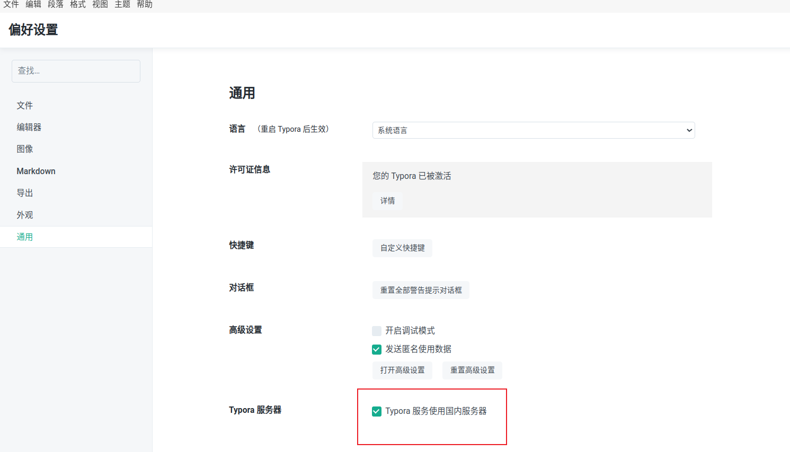

# 开发常用软件安装:computer:

## Linux系统

### VScode

> Visual Studio Code 是一款免费的、轻量级*且可扩展的代码编辑器，适用于构建 Web、桌面和移动应用。它在 Linux、macOS 和 Windows 平台上都可以使用，并且重新定义了代码编辑器，优化了当前 Web 和云应用开发。

安装：

 	1. 进[入vscode官网](https://code.visualstudio.com/updates/v1_74)，下载linux系统对应的安装包，注意版本
 	2. 安装vscode：sudo apt install ./code.deb
 	3. 出现依赖问题时，可安装旧版本vscode。
 	4. vscode开发插件：简体中文插件、C/C++、python、CmakeTools、Ros、OneDarkPro,github copilot, fitten code,isaac

### Vim

### 终端终结者

+ 一款好用的终端工具，命令行安装：sudo apt-get install terminator

### jtop

```bash
sudo apt install python3-pip
sudo -H pip3 install -U jetson-stats

```


### Clash

安装clash for windows linux版本即可。

[下载clash安装包](https://www.clash.la/archives/750/#google_vignette)

clash for windows -x-x-x-x64-linux-tar.gz

解压压缩包：

```bash
tar -zxvf name
```

[下载clash汉化包](https://clashcn.com/clash-for-windows-official)

导入节点：【自行购买导入】

代理ip:


---


### pinyin输入法

### typoral

> 在Ubuntu下使用cargo破解Typoral

#### :one: 克隆仓库

```bash
# 我把可以成功破解的版本1.9.3放在了app目录下
git clone https://github.com/Airporal/MarkDownApp.git
```

#### :two:配置Rust

由于编译项目需要 **Rust** 的支持，所以我们需要配置相关环境(若已有，则可跳过该步骤)

```bash
# 运行官方脚本安装即可
curl --proto '=https' --tlsv1.2 -sSf https://sh.rustup.rs | sh

# 检查 cargo，若看到如下版本信息，则说明配置成功
cargo -V
cargo 1.70.0 (ec8a8a0ca 2023-04-25)
```

#### :three: 编译 Yporaject 项目

```bash
# 进入 Yporaject 项目
cd Yporaject
# 运行编译命令
cargo build
# 查看二进制是否生成,程序名称为 node_inject
ls target/debug
# 尝试运行该二进制程序
cargo run
output: 
no node_modules.asar found
move me to the root of your typora installation(the same directory as executable of electron)
```

请务必确认当前项目目录 **target/debug 下** 是否生成了 **node_inject 二进制程序**

#### :four:复制二进制程序到安装目录下

```bash
# 记录当前目录路径，待会返回需要用到
cur=`pwd`
# 复制二进制程序到相关目录下
sudo cp target/debug/node_inject /usr/share/typora
# 进入相关目录
cd /usr/share/typora
# 给予二进制程序执行权限
sudo chmod +x node_inject
# 运行二进制程序
# (请注意程序运行输出信息，观察是否运行成功！！)
# 若无读写权限,建议使用 sudo ./node_inject
sudo ./node_inject
```

#### :five:生成许可证

```bash
# 返回项目
cd $cur
# 进入 license-gen 文件夹
cd license-gen
# 编译代码
cargo build
# 运行二进制程序
cargo run
# 你将会得到以下输出
output:
    Finished dev [unoptimized + debuginfo] target(s) in 0.00s
     Running `target/debug/license-gen`
License for you: xxxxxx-xxxxxx-xxxxxx-xxxxxx
```



复制 **License for you: xxxxxx-xxxxxx-xxxxxx-xxxxxx** 的那一串激发码，待会需要用到。

#### :six:激活软件

选择国内服务器：文件->偏好设置->通用->Typoral服务器

依次点击界面上方菜单栏选项 **help > my license(帮助 > 我的许可证...)** 

邮箱可以随便填。

然后在第二输入框中，**粘贴刚才得到的激发码**即可成功激活。

---


### NoMachine

### Opencv编译安装

[参照此教程安装](https://blog.csdn.net/weixin_44796670/article/details/115900538)

编译代码如下：

```cmake
cmake -D CMAKE_BUILD_TYPE=RELEASE \
        -D CMAKE_INSTALL_PREFIX=/usr/local/ \
        -D OPENCV_EXTRA_MODULES_PATH=../../opencv_contrib/modules \
        -D WITH_CUDA=ON \
        -D WITH_CUDNN=ON \
        -D BUILD_opencv_python3=ON \
        -D CUDA_ARCH_BIN=8.7 \
        -D CUDA_ARCH_PTX="" \
        -D ENABLE_FAST_MATH=ON \
        -D CUDA_FAST_MATH=ON \
        -D WITH_CUBLAS=ON \
        -D WITH_LIBV4L=ON \
        -D WITH_GSTREAMER=ON \
        -D WITH_NVCUVID=ON \
        -D WITH_GSTREAMER_0_10=OFF \
        -D WITH_QT=ON \
        -D WITH_V4L=ON \
        -D WITH_OPENGL=ON \
        -D CUDA_NVCC_FLAGS="--expt-relaxed-constexpr" \
        -D WITH_TBB=ON \
        -D WITH_PTHREADS_PF=ON \
        ..
```

编译前，给opencv和opencv_contrib/modules/xfeatures2d目录下的CmakeLists.txt文件设置代理:

```cmake
set(ENV{http_proxy} "http://192.168.3.4:7890")
set(ENV{https_proxy} "http://192.168.3.4:7890")
```

安装后，python还无法使用，需要找到build/python_loader并手动执行：

```python
python setup.py build
sudo python setup.py install
```

python测试：

```python
import cv2
# 查看编译信息和cuda支持
print(cv2.cuda.getCudaEnabledDeviceCount())
print(cv2.getBuildInformation())
```

c++测试:

```c++
cmake .
make
./opencv_example
```


### pyrealsense编译安装

### pytorch安装

> 需要先后安装CUDA、cudnn、Anaconda、Pytorch

安装[过程参考](https://blog.csdn.net/KRISNAT/article/details/134870009)，cudnn包[下载链接](https://developer.nvidia.com/rdp/cudnn-archive)

cudnn安装时，需要修改几个文件权限，文件不再include下，而是通过软连接到target下对应位置。

```bash
sudo chmod a+r /usr/local/cuda-12.1/targets/x86_64-linux/include/cudnn.h
sudo chmod a+r /usr/local/cuda-11.8/lib64/libcudnn*
```

[jetson安装时，参考nvidia安装](https://docs.nvidia.com/deeplearning/frameworks/install-pytorch-jetson-platform/index.html)

### ROS2安装

### WSL Ubuntu22.04 issac lab安装

[参考这个链接](https://zhuanlan.zhihu.com/p/397776698)

环境依赖：

Ubuntu22.04；Nvidia 驱动版本535.129.03，

启动与应用可[以参考这个。](https://axi404.github.io/Blog/p/isaac-sim-%E8%B8%A9%E5%9D%91%E6%97%A5%E8%AE%B0/)

## Windows系统

### Opencv+gstreamer编译安装

win下python可直接pip install opencv，但是由于官方提供的编译包为基础包，不包含cuda、gstreamer等特殊功能，所以需要自行编译安装。

编译准备：

下载：visual studio (最好2019版)；cmake gui或MinGW(自动cmake工具)；

everything

dependenciesgui、processMonitor(查看文件、进程依赖关系，分析dll依赖)

安装[gsteramer-runtime和gsteramer-development](https://gstreamer.freedesktop.org/download/)，下载以下文件，会自动安装到当前盘的同一路径下（版本可能与opencv存在依赖关系）


需要具备魔法。

下载[opencv包](https://github.com/opencv/opencv)源码，版本最好与python版本不冲突。可选择下载opencv_contrib.

建议[在conda环境下](https://docs.anaconda.com/)工作，否则后续使用其它版本时麻烦。

1. 下载好gstreamer后，[将该软件目录添加到环境变量](https://galaktyk.medium.com/how-to-build-opencv-with-gstreamer-b11668fa09c)

2. 在opencv源码下建立build文件夹

3. cmakegui中添加源码文件和build文件夹，configure选择对应的visual studio版本，其它默认

4. 自动执行cmakeLists.txt文件中的指令。如果网不好会在github上下载文件失败，导致生成失败

5. 在cmakedownload.txt中自行查找下载的文件，并根据链接自行下载完，放置在build\.cache文件夹下指定目录。全部下载完后重新configure并成功生成。(也可使用魔法)

6. 配置自己需要的编译内容，查看gstreamer部分是否成功识别、python路径是否正确，确认无误后点击configure，全部变白色

7. 点击generate，生成visual studio工程文件，在里面选择release x64模式，点击CmakeTargets\INSTALL build

8. 会自行编译生成指定文件，并安装至指定位置。

9. 对于python版本大于3.8，[无法从系统环境变量读取dll，](https://www.jamesbowley.co.uk/nbs/ImportError_dll_load_failed_while_importing_cv2.html)小于3.8版本的，将编译生成的opencv\build\install\x64\vc64\lib和bin目录添加到PATH环境变量，之后成功import cv2

10. 出现import cv2找不到dll的问题，需要使用依赖分析工具分析cv2.cp310-win_amd.pyd文件依赖关系，将缺失的依赖添加到python可以找到的位置。或使用os命令添加：

    ```python
    import os
    os.add_dll_directory("D:\\build\\opencv\\4_7_0\\cuda_12_D\\bin")
    import cv2
    ```

    全部添加后，可成功import cv2

11. 将dll的位置加入site-packages\cv2\config.py文件下，即可自动导入。

12. 测试opencv

    ```python
    import cv2
    import numpy
    print(cv2.__file__)
    print(cv2.getBuildInformation())
    def show_img(name,img)
    	cv2.imshow(name,img)
    	cv2.waitKey(0)
    	cv2.destroyAllWindows()
    img = cv2.imread(path)
    show_img(img)
    ```

:bus:

### QT安装及Visual studio配置

[参考此教程即可。](https://blog.csdn.net/qq_62888264/article/details/132645054?ops_request_misc=%257B%2522request%255Fid%2522%253A%2522919B6201-48A6-4848-970C-70959EA8D56B%2522%252C%2522scm%2522%253A%252220140713.130102334..%2522%257D&request_id=919B6201-48A6-4848-970C-70959EA8D56B&biz_id=0&utm_medium=distribute.pc_search_result.none-task-blog-2~all~top_positive~default-1-132645054-null-null.142^v100^pc_search_result_base3&utm_term=qt%E5%AE%89%E8%A3%85&spm=1018.2226.3001.4187)


