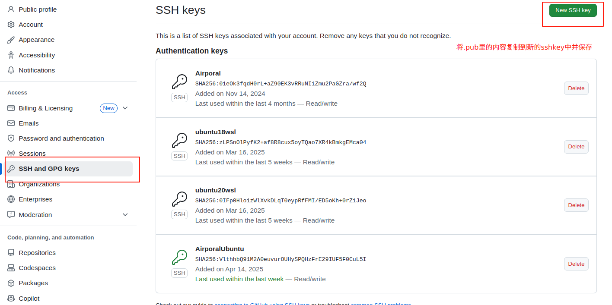

# 问题汇总

> 解决学习、开发过程中的各类型问题。

[TOC]


------

## 1.cv_bridge安装与环境问题

:a:cv_bridge直接安装：

```bash
sudo apt-get install ros-<ros-release>-cv-bridge
```

一般情况下ros自带cv_bridge，但是默认环境如下：

ros：默认python为2.7

python：常用的为3.6

opencv：可能安装了4+

cv_bridge：要求python2，opencv3

:b:cv_bridge编译重新安装：

1. 建立ROS工作空间并初始化

2. git cv_bridge原文件

   ```bash
   sudo apt install python-catkin-tools python3-dev python3-catkin-pkg-modules python3-numpy python3-yaml ros-melodic-cv-bridge
   mkdir -p cv_bridge_ws/src && cd cv_bridge_ws
   git clone https://github.com/ros-perception/vision_opencv.git src/vision_opencv-melodic
   ```

   **注意和ros版本相同**

   此时直接进行编译会由于opencv4版本而编译不通过，opencv3可以跳过第三步，opencv4需要进行第三步。

3. git opencv4修改文件

   ```bash
   cd cv_bridge_ws/src/vision_opencv-melodic
   git clone https://github.com/mhsitu/cv4_bridge.git
   ```

   将该文件替换原目录下的vision_opencv文件。

4. 编译安装cv_bridge

   ```bash
   cd cv_bridge_ws
   # 设置安装连接的python3
   catkin config -DCMAKE_BUILD_TYPE=Release -DPYTHON_EXECUTABLE=/usr/bin/python3 -DPYTHON_INCLUDE_DIR=/usr/include/python3.6m -DPYTHON_LIBRARY=/usr/lib/aarch64-linux-gnu/libpython3.6m.so
   catkin build
   source devel/setup.bash --extend
   ```

   此时可以成功编译

5. 测试cv_bridge

   ```python
   $ source devel/setup.bash --extend
   python3
   import cv_bridge
   from cv_bridge.boost.cv_bridge_boost import getCvType
   ```

   不报错则成功

   ```bash
   # 切换python环境
   sudo update-alternatives --config python
   ```

6. 环境配置

   首先修改   .bashrc 文件，使得每次启动终端时先更新一下环境变量

   ```bash
   source /home/airporal/bishe/cv_bridge_ws/devel/setup.bash --extend
   ```

   在CMakeLists.txt文件里添加：

   ```cmake
   find_package(cv_bridge)
   ```

   7. 使用

   ```python
   from cv_bridge import CvBridge
   # 实例化
   bridge = CvBridge()
   # 将Image转化为numpy
   cv_image = bridge.imgmsg_to_cv2(msg, desired_encoding="passthrough")
   # 将numpy转化为Image
   image_cv = bridge.cv2_to_image(image,desired_encoding="passthrough")
   ```

   可以根据需要修改编码格式：

   passthrough为保持原编码

   mono8为8位灰度图像（mono16)

   bgr8为蓝绿红彩色图像

   rgb8为红绿蓝彩色图像

   bgra8为带a通道的BGR图像（rgba8)

[尝试过此方法失败了](https://blog.csdn.net/bigdog_1027/article/details/79092263)

## 2.ROS-Python问题汇总

1. python节点运行方法

   + vscode代码提示：需要在工作空间下修改.vscode文件下的settings.json文件，增加需要的路径。

   + 使用**rosrun** 功能包名 py文件名运行

     此时会在工作空间主目录下运行该py文件

   + 使用python3 py文件名运行

2. 在节点py文件中调用自己编写的py文件

> 调用后，直接使用rosrun命令运行节点的py文件，会找不到自己编写的py文件，这是因为rosrun在工作空间**主目录下查找不到该依赖。**

使用python3 节点py文件 可以正常调用。

rosrun运行解决办法：

+ 在节点py文件中添加python的临时环境变量

```python
import sys
sys.path.insert(0,"my_utils.py绝对路径")
# 或者 动态获取路径
path = os.path.abspath(".")
sys.path.insert(0,path+"my_utils.py工作空间下相对路径")
import my_utils
```

3. python出现关于解释器的异常

   如果在编写python节点时，不配置cmake，ros可能无法找到python解释器而出现报错，此时可通过软链接的方式解决：

   ```bash
   sudo ln -s /usr/bin/python3 /usr/bin/python
   ```

   

## 3.ROS-CPP及编译问题汇总

出现报错：

```python
runtime library [libpython3.10.so.1.0] in /usr/lib/x86_64-linux-gnu may be hidden by files in: /home/airporal/miniconda3/envs/isaac/lib
```

虚拟环境变量覆盖系统路径，导致无法找到需要的链接库，只需要修改环境变量即可

```python
# 修改前
$PATH=
`/opt/ros/humble/bin:/usr/local/lib/nodejs/bin:/usr/local/cuda-12.1/bin:/home/airporal/miniconda3/bin:/home/airporal/miniconda3/condabin:/usr/local/sbin:/usr/local/bin:/usr/sbin:/usr/bin:/sbin:/bin:/usr/games:/usr/local/games:/snap/bin:/snap/bin'
#修改后
export PATH="/opt/ros/humble/bin:/usr/local/lib/nodejs/bin:/usr/local/cuda-12.1/bin:/home/airporal/miniconda3/condabin:/usr/local/sbin:/usr/local/bin:/usr/sbin:/usr/bin:/sbin:/bin:/usr/games:/usr/local/games:/snap/bin:/snap/bin"
```


## 4. python2的em包缺失问题

catkin_make 使用python3编译：

```bash
# 将python设置为python3(catkin编译python3时可选)
echo "alias python=python3"
catkin_make -DPYTHON_EXECUTABLE=/usr/bin/python3
# 先添加python可选版本
sudo update-alternatives --install /usr/bin/python python /usr/bin/python2.7 2
sudo update-alternatives --install /usr/bin/python python /usr/bin/python3 1
# 再自行更换python版本
update-alternatives --config python
```

```bash
# 报错em缺少***时，重新安装
sudo apt uninstall em
python -m pip install empty
```

编译时其它em包的问题可能与pyhon3版本、em版本有关，可以安装3.3.4版本

```bash
pip install empy==3.3.4
```


## 5.编译杀死报错

+ 由于分配的交换空间占用完，导致cmake终止。停止编译并重新编译即可。出现此报错时可能还存在其它报错，例如缺少依赖包。报错如下：

  ```cmake
  c++:internal compiler error: 已杀死 (program cc1plus)
  ```

  如果无法解决，可以尝试增加临时交换空间：

  ```bash
  # 1. 创建分区
  sudo dd if=/dev/zero of=/swapfile bs=1M count=1024    # 1 * 1024 = 1024 创建 1 g 的内存分区
  sudo mkswap /swapfile
  sudo swapon /swapfile
  
  #free -m    #可以查看内存使用
  #创建完交换分区之后就可以继续编译
  #编译若是还不成功，试着创建更大的分区，比如count=2048
  #2g的分区，基本可以解决。
  
  #2. 关闭分区
  sudo swapoff /swapfile
  sudo rm /swapfile
  
  ```

  使用完毕后要关闭分区，否则会无法开机。

## 6.梯子方法

由于调用git或其他原因无法翻墙，使得编译失败，此时可设置代理：

```
# cmakelists.txt中添加:
set(ENV{http_proxy} "http://127.0.0.1:7890")
set(ENV{https_proxy} "http://127.0.0.1:7890")
```

记得挂梯子，开启TUN模式。

也可以自行下载该依赖到指定位置。

可能需要安装其它依赖，如[GMP、MPFR等，](https://www.jianshu.com/p/15bac866a806)需要先安装后编译.


Linux终端代理方法：

```bash
export http_proxy=http://127.0.0.1:7890
export https_proxy=http://127.0.0.1:7890
# 删除系统代理
unset http_proxy
unset https_proxy
unset HTTP_PROXY
unset HTTPS_PROXY

```

Windows终端代理方法：

```
set http_proxy=http://127.0.0.1:7890
set https_proxy=http://127.0.0.1:7890
```

git的代理方法：

```bash
git config --glob
git config --global https.proxy 192.168.3.4:7890
```

使用python代理：

```python
import os
os.environ["http_proxy"] = "http://127.0.0.1:7890"
os.environ["https_proxy"] = "http://127.0.0.1:7890"
```

pip设置代理：**==【一般无需设置】==**

```
pip config set Global.http-proxy http://127.0.0.1:7890
pip config set Global.https-proxy http://127.0.0.1:7890
```

仅pip设置代理会因为SSL认证问题导致无法下载。需要设置终端代理即可。


## 7 Jetson设备通信问题

jetson设备可以通过网线连接电脑，通过设置ip在一个网段下即可实现通信。


通信后如果相互ping通，可以通过Nomachine在主机上登录Jetson的远程图像界面。

通过主机连接Wifi并设置共享模式，则Jetson也可以通过主机联网。

主机翻墙后，Jetson上通过设置代理为主机IP和端口号可实现翻墙。

编译时，可按照第四个问题的方法设置。

## 8 IMSEE双目相机SDK安装问题

> 该SDK对设备环境要求具体为：opencv3.3.1、Ros。

[配置系统环境：](https://imsee-sdk-docs-new.readthedocs.io/zh-cn/latest/src/sdk/data/get_disparity_with_high_accuracy.html)

+ 首先安装protoc与MNN

  ```bash
  sudo apt-get install autoconf automake libtool
  
  git clone https://github.com/google/protobuf.git
  cd protobuf
  git submodule update --init --recursive
  ./autogen.sh
  ./configure
  make
  make check
  sudo make install
  sudo ldconfig # refresh shared library cache.
  protoc --version # 若安装成功，将显示protoc版本
  
  git clone https://github.com/alibaba/MNN.git
  cd MNN
  ./schema/generate.sh
  mkdir build $$ cd build
  cmake ..
  make -j4
  sudo make install
  ```

+ 之后使用fishros的脚步一键安装ROS

+ 下载Opencv源码，编译安装

  ```bash
  git clone https://github.com/opencv/opencv.git
  cd opencv/
  git checkout tags/3.3.1
  ```

+ 下载IMSEE源码

  ```bash
  git clone https://github.com/indemind/IMSEE-SDK.git
  ```

+ 编译源码

  ```bash
  make init
  make demo
  
  ```

  出现找不到cannot find libopencv_calib3d3.so.3.3的报错：

  ```bash
  sudo ln -s /home/fx/opencv331/installed/lib/libopencv_calib3d.so.3.3 /usr/local/lib/libopencv_calib3d3.so.3.3
  sudo ln -s /home/fx/opencv331/installed/lib/libopencv_videoio.so.3.3 /usr/local/lib/libopencv_videoio3.so.3.3
  sudo ln -s /home/fx/opencv331/installed/lib/libopencv_objdetect.so.3.3 /usr/local/lib/libopencv_objdetect3.so.3.3
  sudo ln -s /home/fx/opencv331/installed/lib/libopencv_imgproc.so.3.3 /usr/local/lib/libopencv_imgproc3.so.3.3
  sudo ln -s /home/fx/opencv331/installed/lib/libopencv_core.so.3.3 /usr/local/lib/libopencv_core3.so.3.3
  
  sudo ldconfig
  ```

  根据自己的安装路径更改名字，生成静态链接库即可。

## 9.电脑拨号上网后无法翻墙

+ 更改代理名称

  **更改前先断开连接。**

  

  

  

+ 设置自动检测

  设置VPN连接代理设置为自动检测设置即可。

  

## 10.vmware 网络问题

长时间未启动虚拟机，再次打开后没有网络：


解决方法：

```bash
service network-manager stop
sudo rm -rf /var/lib/NetworkManager/NetworkManager.state
service network-manager start
```

或者

```bash
sudo dhclient ens33
sudo ifconfig ens33
```

修改固定的ip

```bash
ip:和主机同一网段
掩码:255.255.255.0
网关:查看vmware的配置，一般是。。。2
```

## 11.Box2D即Box2d-kengz的安装

```bash
 pip install swig
 pip install box2d box2d-kengz
```


## 12. windows 连上激活服务器导致无法激活

[参照此解决。](https://blog.csdn.net/weixin_46575363/article/details/137277515)


## 13. 密封设计问题

> 水下结构设计需要进行密封，本处汇总密封设计的方法和要点

+ 防水等级

IPXX (Ingress Protection Rating)，表示防尘防水等级，数字越大越好，对于第二个数：


+ O型圈

硅胶圈预压量为胶圈厚度的30%~40%。太小防水效果不好，太大容易超过变形极限。动密封要小一些。20%以内。圆柱静密封选择10到15，其它平面密封选择15到30。


+ 打胶

在很难安装防水圈又需要防水的结构，使用胶水密封。

UV胶、PUR热熔胶、有机硅胶（透明）

+ 漏水检测

方式1：打内压，并判断是否明显漏气

Ip67要求1米，气压为10KPa。所以打压要大于10KPa

方式2：打压后浸水，持续打压，观测是否有气泡

+ 防水结构连接

[穿线螺丝：用于在相邻近的不同舱之间穿线](https://www.bilibili.com/video/BV1Mg4y197so/?spm_id_from=333.1387.upload.video_card.click)

[水下密封舱法兰：用于舱段之间的连接。](https://www.bilibili.com/video/BV1dG41167DB/?spm_id_from=333.1387.upload.video_card.click)

[真空气嘴和排气螺丝：用于气密检测过程中的打气压](https://www.bilibili.com/video/BV1664y1L77A/?spm_id_from=333.1387.upload.video_card.click&vd_source=48fb9fd680963a4665766c41996e7db1)

+ 其它

凡士林 

灌胶

超声防水

## 14. ssh问题

+ 远程连接github

查看是否已经生成过ssh密钥，或生成密钥：

```bash
ls ~/.ssh
ssh-keygen -t ed25519 -C "your_email@example.com"
#或
ssh-keygen -t rsa -b 4096 -C "your_email@example.com"
eval "$(ssh-agent -s)"
ssh-add ~/.ssh/id_rsa
```

将密钥复制到github：



测试：

```bash
ssh -T git@github.com
# 如果被拒绝连接，可能是端口的问题，使用以下命令检查
ssh -T -p 443 git@ssh.github.com
# 如果以上命令正常，则表示端口22不可以用，更改默认端口：
vim ~/.ssh/config
# 粘贴以下内容保存即可
Host github.com
  HostName ssh.github.com
  User git
  Port 443
  IdentityFile ~/.ssh/id_rsa
# 重新测试
ssh -T git@github.com
```


